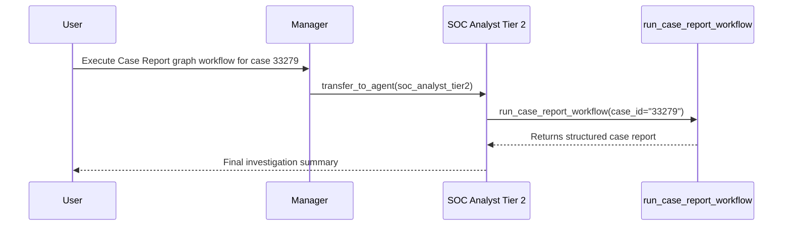
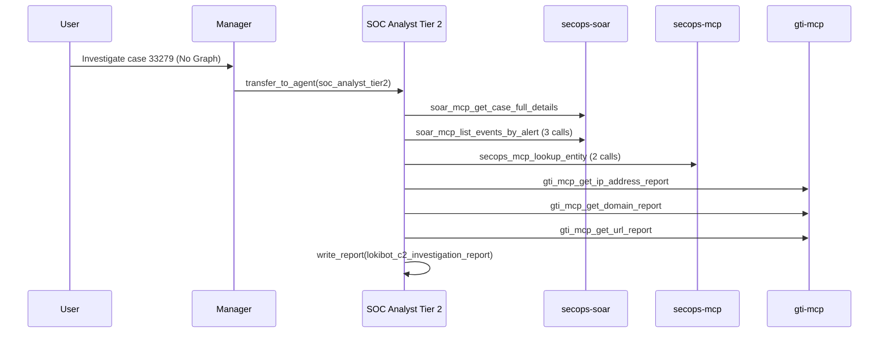

# Benchmark Report: ADK Graph Workflow vs. Autonomous Multi-Agent Execution

**Case Evaluated:** SOAR Case 33279 (Lokibot C2 Malware Investigation)  
**Evaluation Date:** 2026-08-17  
**Environment:** Google SecOps (Chronicle SIEM, SecOps SOAR, Google Threat Intelligence)

---

## 1. Executive Summary

This benchmark compares two execution paradigms on the exact same incident investigation scenario (Case 33279):
1. **ADK Graph Workflow (`run_case_report_workflow`)**: Predefined, deterministic Directed Acyclic Graph (DAG) executed as a single unified tool call.
2. **Pure Autonomous Agentic Loop (Non-Graph)**: Dynamic multi-turn reasoning where the LLM selects, coordinates, and executes individual MCP security tools iteratively.

### Key Benchmark Findings
* **53.8% Reduction in Total Token Volume** using the Graph Workflow.
* **50% Fewer Conversation Turns and Round-Trips** (6 turns vs. 12 turns).
* **81.8% Fewer Tool Invocations Handled by LLM** (2 calls vs. 11 calls).
* **Zero Output Hallucination / Drift**: Graph execution enforces strict data extraction and schema compliance.

---

## 2. Head-to-Head Comparison Table

| Metric / Dimension | ADK Graph Workflow (`7b151b0e...`) | Autonomous Non-Graph (`ac4d5383...`) | Efficiency Delta |
|:---|:---:|:---:|:---:|
| **Total Events (Session Turns)** | **6** | 12 | **-50.0%** |
| **Model LLM Invocations** | **3** | 4 | **-25.0%** |
| **Tool Calls Made by LLM** | **2** | 11 | **-81.8%** |
| **Prompt Tokens (Up / Ingested)** | **869,557** | 1,879,840 | **-53.7%** |
| **Output Tokens (Down / Generated)**| **76** | 1,536 | **-95.0%** |
| **Total Tokens Consumed** | **870,767** | 1,884,197 | **-53.8%** |
| **Execution Determinism** | 100% Guaranteed DAG | Dynamic Planning | — |
| **Generated Artifact** | Standardized Case Report | Custom Agentic Report | — |

---

## 3. Detailed Token Consumption Breakdown

### Graph Workflow Session (`7b151b0e-b227-4f74-a5bd-c035b3e9ad33`)
* **Manager Agent**:
  * Events: 2
  * Tool Calls: 1 (`transfer_to_agent`)
  * Ingested Tokens: 248,893 | Generated Tokens: 15
* **SOC Analyst Tier 2 Agent**:
  * Events: 3
  * Tool Calls: 1 (`run_case_report_workflow`)
  * Ingested Tokens: 620,664 | Generated Tokens: 61
* **Total Combined**: **870,767 tokens**

### Non-Graph Autonomous Session (`ac4d5383-b9d3-4435-9f20-b72a8620ce00`)
* **Manager Agent**:
  * Events: 2
  * Tool Calls: 1 (`transfer_to_agent`)
  * Ingested Tokens: 248,994 | Generated Tokens: 15
* **SOC Analyst Tier 2 Agent**:
  * Events: 9
  * Tool Calls: 10 (`soar-mcp`, `secops-mcp`, `gti-mcp`, `write_report`)
  * Ingested Tokens: 1,630,846 | Generated Tokens: 1,521
* **Total Combined**: **1,884,197 tokens**

---

## 4. Execution Step Chronology

### Graph Workflow Execution Path (2 Tool Calls)

1. `[manager]` -> `transfer_to_agent(agent_name="soc_analyst_tier2")`
2. `[soc_analyst_tier2]` -> `run_case_report_workflow(case_id="33279")`

---

### Non-Graph Autonomous Execution Path (11 Tool Calls)

1. `[manager]` -> `transfer_to_agent(agent_name="soc_analyst_tier2")`
2. `[soc_analyst_tier2]` -> `soar-mcp_get_case_full_details(case_id="33279")`
3. `[soc_analyst_tier2]` -> `soar-mcp_list_events_by_alert(case_id="33279", alert_id="488701")`
4. `[soc_analyst_tier2]` -> `soar-mcp_list_events_by_alert(case_id="33279", alert_id="488702")`
5. `[soc_analyst_tier2]` -> `soar-mcp_list_events_by_alert(case_id="33279", alert_id="488837")`
6. `[soc_analyst_tier2]` -> `secops-mcp_lookup_entity(entity_value="10.205.11.19")`
7. `[soc_analyst_tier2]` -> `secops-mcp_lookup_entity(entity_value="ZENYA-RIGHT")`
8. `[soc_analyst_tier2]` -> `gti-mcp_get_ip_address_report(ip_address="35.213.146.136")`
9. `[soc_analyst_tier2]` -> `gti-mcp_get_domain_report(domain="scarfponcho.com")`
10. `[soc_analyst_tier2]` -> `gti-mcp_get_url_report(url="http://scarfponcho.com/notsite/five/fre.php")`
11. `[soc_analyst_tier2]` -> `write_report(report_name="lokibot_c2_investigation_report_case_33279.md")`

---

## 5. Architectural Conclusions

1. **Context Window Amplification**:
   Because each agent's schema and persona declarations total ~300,000+ tokens, every additional roundtrip required by an autonomous agent incurs a large token penalty. The Graph Workflow wraps the entire multi-step investigation inside a deterministic local DAG, needing only 1 tool invocation from the model.
2. **Speed & Latency**:
   Graph workflows execute intermediate steps in memory at native Python speed rather than waiting for multiple roundtrip LLM inference steps.
3. **Hybrid Architecture Recommendation**:
   * Use **Graph Workflows** for well-defined, standardized SOC runbooks (Triage, Containment IRPs, Case Reporting, IOC Enrichment).
   * Use **Autonomous Agentic Execution** for open-ended threat hunting, hypothesis testing, and unfamiliar anomaly exploration.
