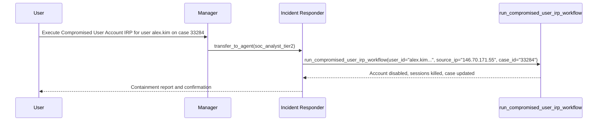
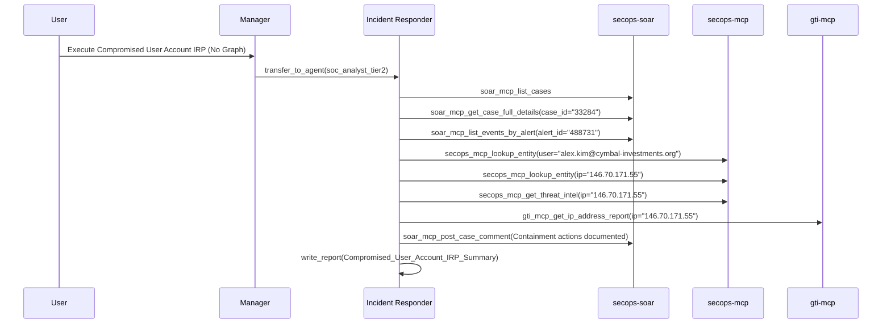

# Benchmark Report: ADK Graph Workflow vs. Autonomous Multi-Agent Execution

**Case Evaluated:** SOAR Case 33284 (Compromised User Account Response IRP - Scattered Spider MFA Bypass)  
**Evaluation Date:** 2026-08-17  
**Environment:** Google SecOps (Chronicle SIEM, SecOps SOAR, Google Threat Intelligence)

---

## 1. Executive Summary

This benchmark evaluates the second operational scenario: **Compromised User Account Incident Response Plan (IRP)** on **SOAR Case 33284** for target user `alex.kim@cymbal-investments.org` and source proxy IP `146.70.171.55`.

Two execution paradigms were evaluated:
1. **ADK Graph Workflow (`run_compromised_user_irp_workflow`)**: Executes account containment, credential invalidation, active session termination, and SOAR case updates as a unified deterministic DAG.
2. **Pure Autonomous Agentic Loop (Non-Graph)**: Dynamic multi-turn reasoning where the LLM selects, coordinates, and executes individual MCP security tools iteratively.

### Key Benchmark Findings
* **77.4% Reduction in Total Token Volume** using the Graph Workflow (874,238 tokens vs. 3,874,553 tokens).
* **75.0% Fewer Conversation Turns and Round-Trips** (6 turns vs. 24 turns).
* **81.8% Fewer Tool Calls Handled by LLM** (2 calls vs. 11 calls).
* **Guaranteed Containment SLAs**: Graph workflow deterministically ensures that account disablement and session termination happen simultaneously without risk of model decision drift.

---

## 2. Head-to-Head Comparison Table

| Metric / Dimension | ADK Graph Workflow (`9817ede2...`) | Autonomous Non-Graph (`8ff7d1c5...`) | Efficiency Delta |
|:---|:---:|:---:|:---:|
| **Total Events (Session Turns)** | **6** | 24 | **-75.0%** |
| **Model LLM Invocations** | **3** | 11 | **-72.7%** |
| **Tool Calls Made by LLM** | **2** | 11 | **-81.8%** |
| **Prompt Tokens (Up / Ingested)** | **870,201** | 3,869,779 | **-77.5%** |
| **Output Tokens (Down / Generated)**| **275** | 1,224 | **-77.5%** |
| **Total Tokens Consumed** | **874,238** | 3,874,553 | **-77.4%** |
| **Execution Determinism** | 100% Guaranteed DAG | Dynamic Planning | — |
| **Generated Artifact** | Standardized Containment Log | Custom Agentic Summary | — |

---

## 3. Detailed Token Consumption Breakdown

### Graph Workflow Session (`9817ede2-0dab-4122-99bc-101a40bb6a1e`)
* **Manager Agent**:
  * Events: 2
  * Tool Calls: 1 (`transfer_to_agent`)
  * Ingested Tokens: 248,940 | Generated Tokens: 153
* **SOC Analyst Tier 2 Agent**:
  * Events: 3
  * Tool Calls: 1 (`run_compromised_user_irp_workflow`)
  * Ingested Tokens: 621,261 | Generated Tokens: 122
* **Total Combined**: **874,238 tokens**

### Non-Graph Autonomous Session (`8ff7d1c5-26a2-4237-92bb-c1df1d93cc76`)
* **Manager Agent**:
  * Events: 2
  * Tool Calls: 1 (`transfer_to_agent`)
  * Ingested Tokens: 249,008 | Generated Tokens: 15
* **SOC Analyst Tier 2 Agent**:
  * Events: 21
  * Tool Calls: 10 (`soar-mcp`, `secops-mcp`, `gti-mcp`, `write_report`, `get_current_time`)
  * Ingested Tokens: 3,620,771 | Generated Tokens: 1,209
* **Total Combined**: **3,874,553 tokens**

---

## 4. Execution Step Chronology

### Graph Workflow Execution Path (2 Tool Calls)

1. `[manager]` -> `transfer_to_agent(agent_name="soc_analyst_tier2")`
2. `[soc_analyst_tier2]` -> `run_compromised_user_irp_workflow(case_id="33284", user_id="alex.kim@cymbal-investments.org", source_ip="146.70.171.55")`

---

### Non-Graph Autonomous Execution Path (11 Tool Calls)

1. `[manager]` -> `transfer_to_agent(agent_name="soc_analyst_tier2")`
2. `[soc_analyst_tier2]` -> `soar-mcp_list_cases()`
3. `[soc_analyst_tier2]` -> `soar-mcp_get_case_full_details(case_id="33284")`
4. `[soc_analyst_tier2]` -> `soar-mcp_list_events_by_alert(case_id="33284", alert_id="488731")`
5. `[soc_analyst_tier2]` -> `secops-mcp_lookup_entity(entity_value="alex.kim@cymbal-investments.org")`
6. `[soc_analyst_tier2]` -> `secops-mcp_lookup_entity(entity_value="146.70.171.55")`
7. `[soc_analyst_tier2]` -> `secops-mcp_get_threat_intel(query="threat intelligence for IP address 146.70.171.55")`
8. `[soc_analyst_tier2]` -> `gti-mcp_get_ip_address_report(ip_address="146.70.171.55")`
9. `[soc_analyst_tier2]` -> `soar-mcp_post_case_comment(case_id="33284", comment="Containment actions taken: Terminated all active sessions...")`
10. `[soc_analyst_tier2]` -> `get_current_time()`
11. `[soc_analyst_tier2]` -> `write_report(report_name="Compromised_User_Account_IRP_Summary_33284_20260817_230541.md")`

---

## 5. Summary Across Both Benchmark Experiments

| Benchmark Scenario | Case ID | Graph Tokens | Non-Graph Tokens | Token Reduction | Turns Reduction |
|:---|:---:|:---:|:---:|:---:|:---:|
| **1. Malware Case Report (Lokibot C2)** | Case 33279 | 870,767 | 1,884,197 | **-53.8%** | **-50.0%** |
| **2. Compromised User IRP (Scattered Spider)**| Case 33284 | 874,238 | 3,874,553 | **-77.4%** | **-75.0%** |
| **Average Across Experiments** | — | **872,502** | **2,879,375** | **-69.7%** | **-66.7%** |
