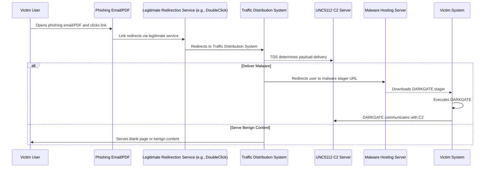
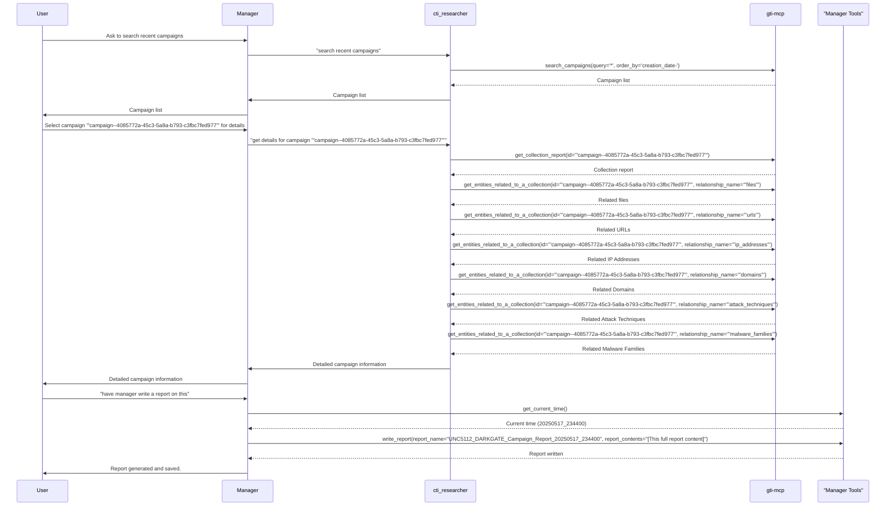

# Campaign Report: UNC5112 Distributes DARKGATE

**Campaign ID:** `campaign--4085772a-45c3-5a8a-b793-c3fbc7fed977`
**Alternative Name:** CAMP.24.013
**Report Date:** 2025-05-17 23:44:00 UTC

## Overview
This report details the activities of the distribution cluster UNC5112, observed distributing the DARKGATE malware. The campaign, first seen on January 26, 2024, and last observed on May 6, 2024, is financially motivated and targets organizations in the United States and Canada.

## Description
UNC5112 employs phishing techniques, embedding malicious links within PDF attachments or directly in email bodies. These links leverage legitimate redirection services (e.g., DoubleClick, ClickCease) to route victims through a Traffic Distribution System (TDS). The TDS then selectively serves either a blank page or a malicious stager file, leading to the deployment of the DARKGATE malware. DARKGATE has gained prominence among various threat actors and is sometimes a precursor to ransomware attacks.

## Targeted Sectors
*   Education
*   Financial Services
*   Manufacturing
*   Technology

## Targeted Regions
*   Canada (CA)
*   United States (US)

## Motivation
*   Financial Gain

## Key IOCs

*   **Files:**
    *   `8a2edeef9978d454882bfb233d9cd77505618b854f7899b27aeb095ff8ebb3f4`
    *   `237d1bca6e056df5bb16a1216a434634109478f882d3b1d58344c801d184f95d`
    *   `b285a2a2da41e02edd0e090cf3900db0` (MD5)
    *   `89ad6083de9e791d0a5cf754f4a0a4f54a9e6e1a1b7d8d3dd4726da182c4be65`
*   **URLs:**
    *   `http://lili19mainmasters.com:8094/`
    *   `https://computersupportexperts.com/css/down.exe`
*   **IP Addresses:**
    *   `207.246.70.132`
*   **Domains:**
    *   `stachmentsuprimeresult.com`
    *   `renedamsbak.dk`
    *   `computersupportexperts.com`
    *   `porsherses.com`
    *   `asareholdings.com`
    *   `rourtmanjsdadhfakja.com`

## Associated Malware
*   DARKGATE (`malware--9b4c8ed0-8881-5393-bb51-9200017544f8`)

## MITRE ATT&CK Techniques (Selected from 48 total)
*   T1010: Application Window Discovery
*   T1012: Query Registry
*   T1027: Obfuscated Files or Information
    *   T1027.001: Binary Padding
*   T1033: System Owner/User Discovery
*   T1036: Masquerading
    *   T1036.001: Invalid Code Signature
*   T1055: Process Injection
    *   T1055.003: Thread Execution Hijacking
    *   T1055.012: Process Hollowing

## Attack Workflow Diagram

## Agent and Tool Workflow
This section details the sequence of agent interactions and MCP tool usage that led to the generation of this report.

## Recommendations
*   Block listed IOCs (IPs, Domains, URLs, File Hashes).
*   Educate users on phishing attacks, particularly those involving link redirections and unexpected file downloads.
*   Monitor for the listed MITRE ATT&CK techniques.
*   Ensure endpoint detection and response (EDR) solutions are up-to-date and configured to detect and prevent DARKGATE and similar malware.
*   Organizations in the targeted sectors should be particularly vigilant.
