# Agent Workflow References

This document contains references to blog posts and other resources that demonstrate how to organize agents into workflows.

We use the document as a reference when thinking about building agentic workflows.

## References

* [Agent Patterns with ADK (1 Agent, 5 Ways!)](https://medium.com/google-cloud/agent-patterns-with-adk-1-agent-5-ways-58bff801c2d6)
* [Multi-Agent Systems in ADK¶
](https://google.github.io/adk-docs/agents/multi-agents/)
* [Workflow Agents](https://google.github.io/adk-docs/agents/workflow-agents/)
* [Custom agents](https://google.github.io/adk-docs/agents/custom-agents/)
* [Accelerate ADK development with Claude Code + GitHub MCP Server](https://medium.com/google-cloud/accelerate-adk-development-with-claude-code-github-mcp-server-7a5052d481bc)
* [Expanding ADK AI agent capabilities with tools](https://medium.com/google-cloud/expanding-adk-ai-agent-capabilities-with-tools-008a929d1ffb)


#### References to Research (ToDo)
  *  [ ] [Build a RAG Agent using Google ADK and Vertex AI RAG Engine](https://medium.com/google-cloud/build-a-rag-agent-using-google-adk-and-vertex-ai-rag-engine-bb1e6b1ee09d)
  *  [ ] [A practical guide to building Multi-Agents AI Systems with A2A](https://medium.com/google-cloud/a-practical-guide-to-building-multi-agents-ai-systems-with-a2a-2c0e3d77af24)
  *  [ ] [](https://medium.com/google-cloud/the-agent-as-tool-antipattern-analyzing-protocol-mismatches-in-peer-to-peer-multi-agent-36a44a5f724b)
  *  [ ] [Using HTTP endpoints as tools with MCP Toolbox for Databases
Using HTTP endpoints as tools with MCP Toolbox for Databases](https://medium.com/google-cloud/using-http-endpoints-as-tools-with-mcp-toolbox-for-databases-e93ab75b60cd)
  *  [ ] [Guide to Google Agent Development Kit (ADK)
](https://www.aalpha.net/blog/google-agent-development-kit-adk-for-multi-agent-applications/)
  *  [ ] []()
  *  [ ] []()

## Agent Design Patterns

Based on the "Guide to Google Agent Development Kit (ADK)" article, here are key workflow patterns for organizing multi-agent systems:

### 1. Sequential Chain (Assembly Line)
- Each agent hands off its output to the next agent in a linear fashion
- Example flow: `Input → Classifier Agent → Retriever Agent → Summarizer Agent → Formatter Agent → Output`
- Best for tasks that are distinct and don't require collaboration between agents
- **Best Visualization**: Data Flow Diagram (DFD) or Simple Flow Chart

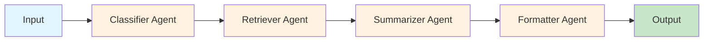
```mermaid
flowchart LR
    A[Input] --> B[Classifier Agent]
    B --> C[Retriever Agent]
    C --> D[Summarizer Agent]
    D --> E[Formatter Agent]
    E --> F[Output]

    style A fill:#e1f5fe
    style F fill:#c8e6c9
    style B fill:#fff3e0
    style C fill:#fff3e0
    style D fill:#fff3e0
    style E fill:#fff3e0
```

### 2. Planner + Executor Pattern
- **Planner Agent**: Determines the tasks needed to reach a goal
- **Executor Agents**: Handle individual tasks (e.g., search, email, code generation)
- Good for multi-step goals like "create a presentation" or "summarize 10 PDFs and email the summary"
- Can be implemented using LangGraph's planner/executor pattern or ADK's agent_executor
- **Best Visualization**: Sequence Diagram (planning phase → execution flows)

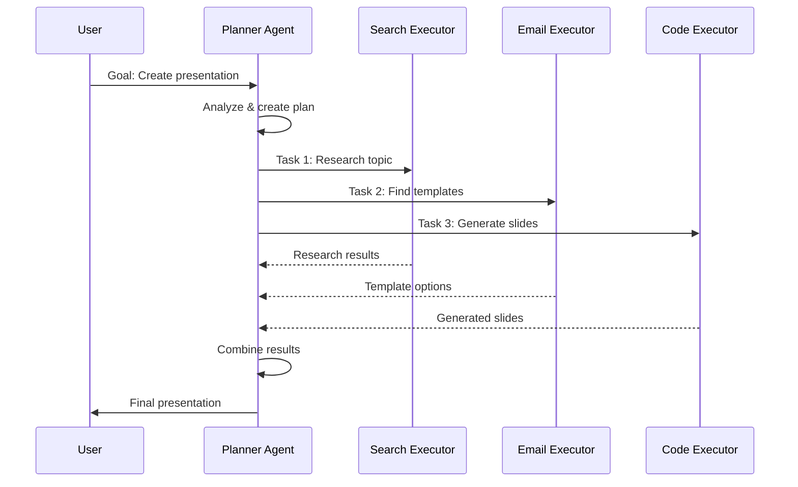
```mermaid
sequenceDiagram
    participant U as User
    participant P as Planner Agent
    participant E1 as Search Executor
    participant E2 as Email Executor
    participant E3 as Code Executor

    U->>P: Goal: Create presentation
    P->>P: Analyze & create plan
    P->>E1: Task 1: Research topic
    P->>E2: Task 2: Find templates
    P->>E3: Task 3: Generate slides

    E1-->>P: Research results
    E2-->>P: Template options
    E3-->>P: Generated slides

    P->>P: Combine results
    P->>U: Final presentation
```

### 3. Negotiating Agents (Swarm AI)
- Multiple agents evaluate a situation and vote or reach consensus on the best approach
- Used in scenarios requiring multiple perspectives:
  - Legal decisions
  - Risk assessments
  - Product recommendations
- Agents can specialize in different domains (finance, legal, ethics)
- **Best Visualization**: Network/Graph Diagram (showing voting/consensus relationships)

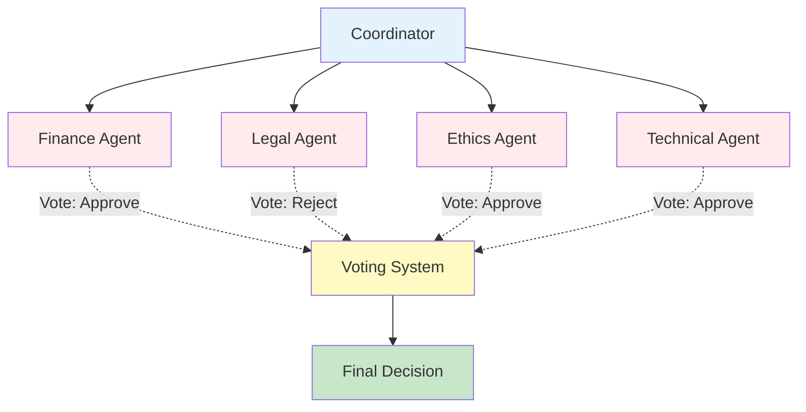
```mermaid
graph TD
    C[Coordinator]
    F[Finance Agent]
    L[Legal Agent]
    E[Ethics Agent]
    T[Technical Agent]
    V[Voting System]
    D[Final Decision]

    C --> F
    C --> L
    C --> E
    C --> T

    F -.->|Vote: Approve| V
    L -.->|Vote: Reject| V
    E -.->|Vote: Approve| V
    T -.->|Vote: Approve| V

    V --> D

    style C fill:#e3f2fd
    style V fill:#fff9c4
    style D fill:#c8e6c9
    style F fill:#ffebee
    style L fill:#ffebee
    style E fill:#ffebee
    style T fill:#ffebee
```

### 4. Critic and Refiner Loop
- One agent generates output, another reviews and improves it
- Example: `Writer Agent → Critic Agent → Rewrite Agent`
- Can include human-in-the-loop as a final step
- Useful for tasks like:
  - Email writing
  - Long-form reports
  - Summarization
- **Best Visualization**: Sequence Diagram with feedback loops or State Transition Diagram

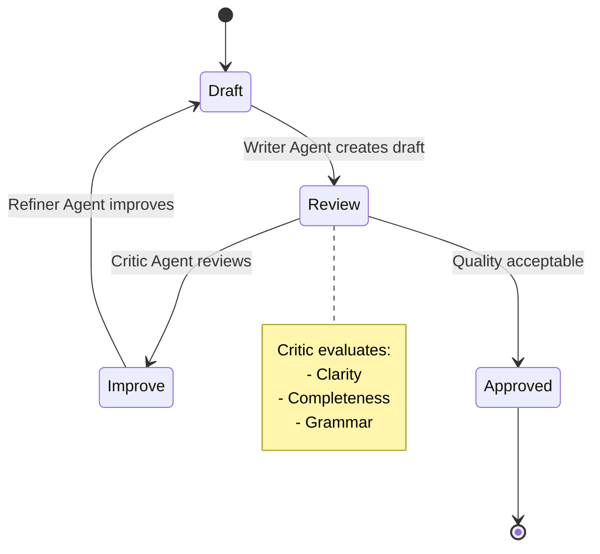
```mermaid
stateDiagram-v2
    [*] --> Draft
    Draft --> Review: Writer Agent creates draft
    Review --> Improve: Critic Agent reviews
    Review --> Approved: Quality acceptable
    Improve --> Draft: Refiner Agent improves
    Approved --> [*]

    note right of Review
        Critic evaluates:
        - Clarity
        - Completeness
        - Grammar
    end note
```

### 5. Role-Based Collaboration (Teams)
- Assigns different roles with specific responsibilities
- Example: `Researcher Agent → Fact-checker Agent → Presenter Agent`
- Each agent accesses different:
  - Tools
  - Knowledge bases
  - Personas
- Mimics human teamwork with delegation
- **Best Visualization**: Hierarchical/Tree Diagram (org chart style) + Sequence Diagram for interactions

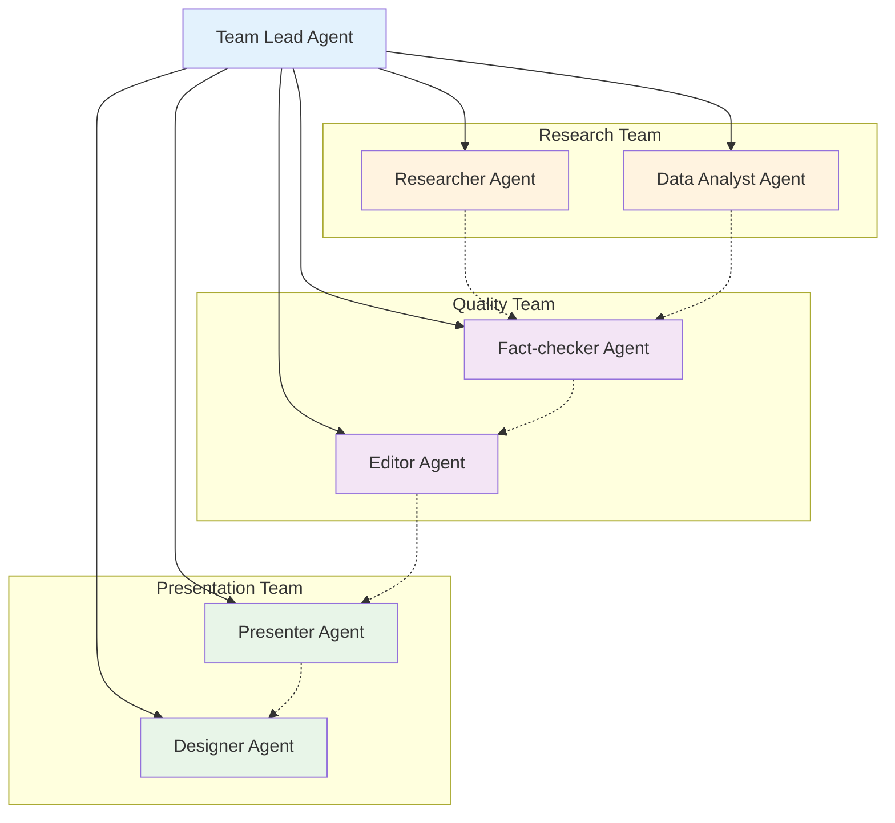
```mermaid
graph TD
    TL[Team Lead Agent]

    subgraph Research Team
        R1[Researcher Agent]
        R2[Data Analyst Agent]
    end

    subgraph Quality Team
        FC[Fact-checker Agent]
        E[Editor Agent]
    end

    subgraph Presentation Team
        P[Presenter Agent]
        D[Designer Agent]
    end

    TL --> R1
    TL --> R2
    TL --> FC
    TL --> E
    TL --> P
    TL --> D

    R1 -.-> FC
    R2 -.-> FC
    FC -.-> E
    E -.-> P
    P -.-> D

    style TL fill:#e3f2fd
    style R1 fill:#fff3e0
    style R2 fill:#fff3e0
    style FC fill:#f3e5f5
    style E fill:#f3e5f5
    style P fill:#e8f5e8
    style D fill:#e8f5e8
```

### 6. Recursive Orchestration and Planning
- The orchestrator breaks down tasks into subtasks
- Can loop through iterations
- Can assign outputs of one agent back into the system for further analysis
- Example: For "How can we reduce carbon emissions in urban areas?", the orchestrator:
  1. Breaks into subtasks (transportation, housing, industry)
  2. Assigns to specialized agents
  3. Recombines responses
  4. Runs final synthesis
- **Best Visualization**: Data Flow Diagram (showing decomposition/synthesis flows) + Tree Diagram for task breakdown

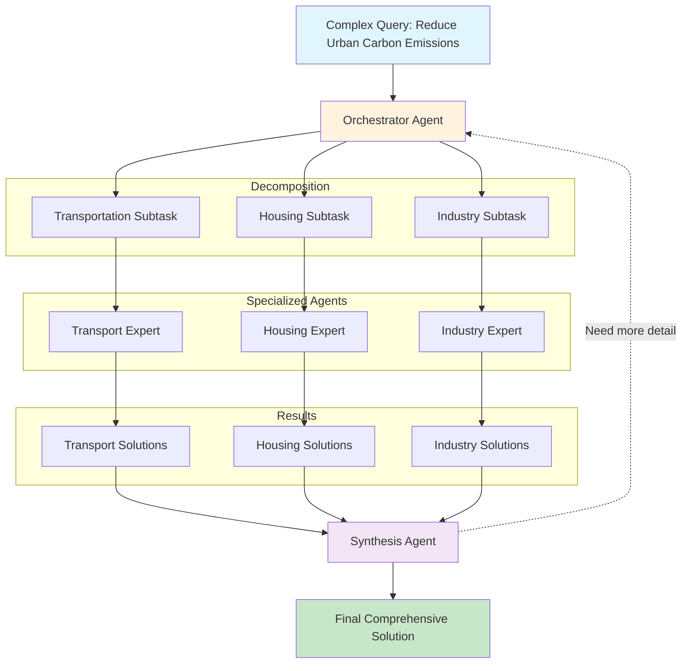
```mermaid
flowchart TD
    Q[Complex Query: Reduce Urban Carbon Emissions]
    O[Orchestrator Agent]

    subgraph Decomposition
        T1[Transportation Subtask]
        T2[Housing Subtask]
        T3[Industry Subtask]
    end

    subgraph Specialized Agents
        A1[Transport Expert]
        A2[Housing Expert]
        A3[Industry Expert]
    end

    subgraph Results
        R1[Transport Solutions]
        R2[Housing Solutions]
        R3[Industry Solutions]
    end

    S[Synthesis Agent]
    F[Final Comprehensive Solution]

    Q --> O
    O --> T1
    O --> T2
    O --> T3

    T1 --> A1
    T2 --> A2
    T3 --> A3

    A1 --> R1
    A2 --> R2
    A3 --> R3

    R1 --> S
    R2 --> S
    R3 --> S

    S --> F

    %% Recursive feedback loop
    S -.->|Need more detail| O

    style Q fill:#e1f5fe
    style O fill:#fff3e0
    style S fill:#f3e5f5
    style F fill:#c8e6c9
```

### 7. Dynamic Agent Spawning
- Agents are instantiated on-demand based on:
  - Task type
  - System load
  - Contextual needs
- Benefits include:
  - Scalability (only use compute when needed)
  - Modularity (add/remove capabilities without changing orchestrator logic)
  - Personalization (spawn agents tailored to specific users or domains)
- **Best Visualization**: Architecture Diagram (infrastructure view) + Tree Diagram showing spawning hierarchy

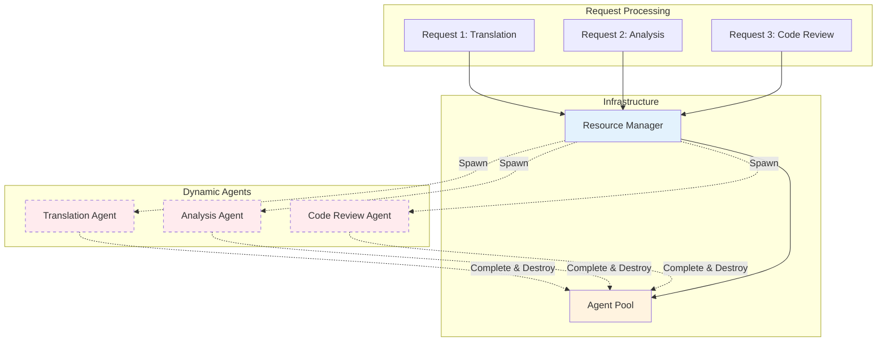
```mermaid
graph TD
    subgraph Infrastructure
        RM[Resource Manager]
        AP[Agent Pool]
    end

    subgraph Request Processing
        R1[Request 1: Translation]
        R2[Request 2: Analysis]
        R3[Request 3: Code Review]
    end

    subgraph Dynamic Agents
        A1[Translation Agent]
        A2[Analysis Agent]
        A3[Code Review Agent]
    end

    R1 --> RM
    R2 --> RM
    R3 --> RM

    RM -.->|Spawn| A1
    RM -.->|Spawn| A2
    RM -.->|Spawn| A3

    A1 -.->|Complete & Destroy| AP
    A2 -.->|Complete & Destroy| AP
    A3 -.->|Complete & Destroy| AP

    RM --> AP

    style RM fill:#e3f2fd
    style AP fill:#fff3e0
    style A1 fill:#ffebee,stroke-dasharray: 5 5
    style A2 fill:#ffebee,stroke-dasharray: 5 5
    style A3 fill:#ffebee,stroke-dasharray: 5 5
```

### 8. Hierarchical Delegation
- Tree-like structure with parent-child relationships
- Parent agents delegate to specialized child agents
- Each level handles different abstraction levels
- Example: `CEO Agent → Department Head Agents → Team Lead Agents → Worker Agents`
- Good for complex organizational workflows
- **Best Visualization**: Hierarchical/Tree Diagram (org chart style)

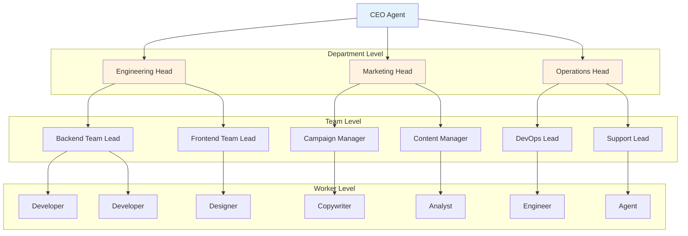
```mermaid
graph TD
    CEO[CEO Agent]

    subgraph Department Level
        ENG[Engineering Head]
        MKT[Marketing Head]
        OPS[Operations Head]
    end

    subgraph Team Level
        TL1[Backend Team Lead]
        TL2[Frontend Team Lead]
        TL3[Campaign Manager]
        TL4[Content Manager]
        TL5[DevOps Lead]
        TL6[Support Lead]
    end

    subgraph Worker Level
        W1[Developer]
        W2[Developer]
        W3[Designer]
        W4[Copywriter]
        W5[Analyst]
        W6[Engineer]
        W7[Agent]
    end

    CEO --> ENG
    CEO --> MKT
    CEO --> OPS

    ENG --> TL1
    ENG --> TL2
    MKT --> TL3
    MKT --> TL4
    OPS --> TL5
    OPS --> TL6

    TL1 --> W1
    TL1 --> W2
    TL2 --> W3
    TL3 --> W4
    TL4 --> W5
    TL5 --> W6
    TL6 --> W7

    style CEO fill:#e3f2fd
    style ENG fill:#fff3e0
    style MKT fill:#fff3e0
    style OPS fill:#fff3e0
```

### 9. Bidding/Auction Pattern
- Agents compete for tasks based on their capabilities and availability
- Coordinator announces tasks and agents submit bids
- Best-suited agent wins the task
- Useful for resource optimization and load balancing
- Example: Multiple translation agents bidding on language-specific tasks
- **Best Visualization**: Swimlane Diagram (showing bidding process) or Sequence Diagram

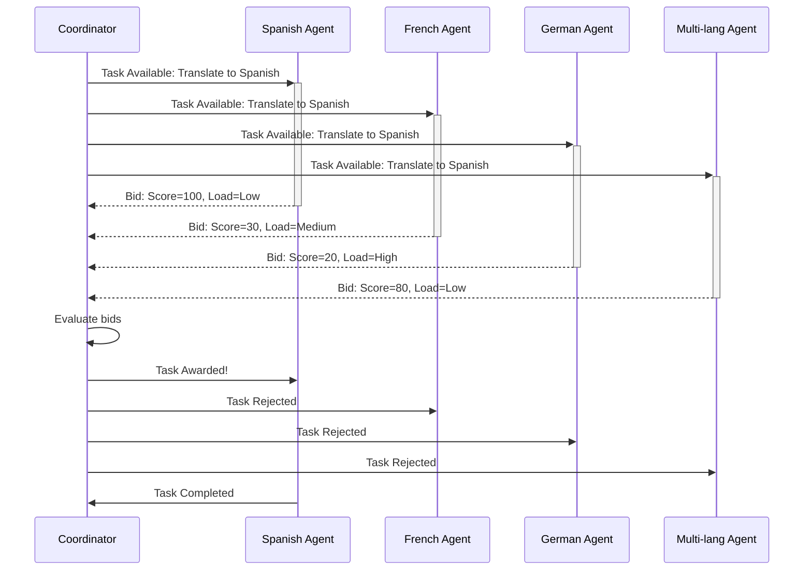
```mermaid
sequenceDiagram
    participant C as Coordinator
    participant A1 as Spanish Agent
    participant A2 as French Agent
    participant A3 as German Agent
    participant A4 as Multi-lang Agent

    C->>+A1: Task Available: Translate to Spanish
    C->>+A2: Task Available: Translate to Spanish
    C->>+A3: Task Available: Translate to Spanish
    C->>+A4: Task Available: Translate to Spanish

    A1-->>-C: Bid: Score=100, Load=Low
    A2-->>-C: Bid: Score=30, Load=Medium
    A3-->>-C: Bid: Score=20, Load=High
    A4-->>-C: Bid: Score=80, Load=Low

    C->>C: Evaluate bids
    C->>A1: Task Awarded!
    C->>A2: Task Rejected
    C->>A3: Task Rejected
    C->>A4: Task Rejected

    A1->>C: Task Completed
```

### 10. Publish-Subscribe (Event-Driven)
- Agents subscribe to specific types of events or topics
- When events occur, relevant agents are automatically triggered
- Loose coupling between agents
- Good for reactive systems and monitoring scenarios
- Example: Alert agents subscribing to security event streams
- **Best Visualization**: Network/Graph Diagram (hub-and-spoke with event channels)

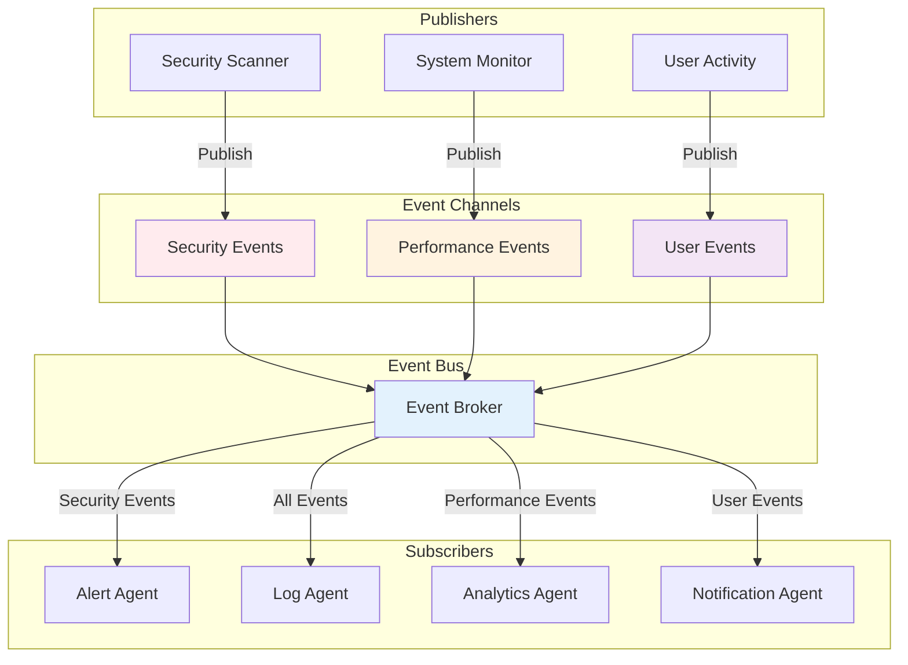
```mermaid
graph TD
    subgraph Event Bus
        EB[Event Broker]
    end

    subgraph Publishers
        P1[Security Scanner]
        P2[System Monitor]
        P3[User Activity]
    end

    subgraph Event Channels
        EC1[Security Events]
        EC2[Performance Events]
        EC3[User Events]
    end

    subgraph Subscribers
        S1[Alert Agent]
        S2[Log Agent]
        S3[Analytics Agent]
        S4[Notification Agent]
    end

    P1 -->|Publish| EC1
    P2 -->|Publish| EC2
    P3 -->|Publish| EC3

    EC1 --> EB
    EC2 --> EB
    EC3 --> EB

    EB -->|Security Events| S1
    EB -->|All Events| S2
    EB -->|Performance Events| S3
    EB -->|User Events| S4

    style EB fill:#e3f2fd
    style EC1 fill:#ffebee
    style EC2 fill:#fff3e0
    style EC3 fill:#f3e5f5
```

### 11. Blackboard Pattern
- Shared knowledge space where agents read/write information
- Multiple agents contribute partial solutions to a common problem
- No direct agent-to-agent communication
- Example: Multiple analysis agents contributing findings to a shared investigation board
- **Best Visualization**: Network/Graph Diagram (shared central space with connected agents)

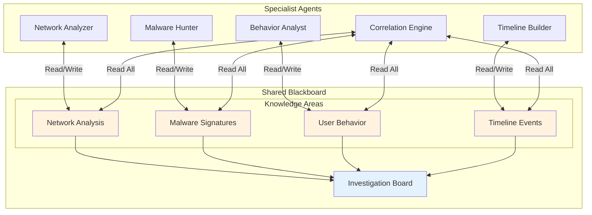
```mermaid
graph TD
    subgraph Shared Blackboard
        BB[Investigation Board]
        subgraph Knowledge Areas
            K1[Network Analysis]
            K2[Malware Signatures]
            K3[User Behavior]
            K4[Timeline Events]
        end
    end

    subgraph Specialist Agents
        A1[Network Analyzer]
        A2[Malware Hunter]
        A3[Behavior Analyst]
        A4[Timeline Builder]
        A5[Correlation Engine]
    end

    A1 <-->|Read/Write| K1
    A2 <-->|Read/Write| K2
    A3 <-->|Read/Write| K3
    A4 <-->|Read/Write| K4

    A5 <-->|Read All| K1
    A5 <-->|Read All| K2
    A5 <-->|Read All| K3
    A5 <-->|Read All| K4

    K1 --> BB
    K2 --> BB
    K3 --> BB
    K4 --> BB

    style BB fill:#e3f2fd
    style K1 fill:#fff3e0
    style K2 fill:#fff3e0
    style K3 fill:#fff3e0
    style K4 fill:#fff3e0
```

### 12. Mediator Pattern
- Central mediator manages all inter-agent communication
- Agents don't communicate directly with each other
- Reduces coupling and simplifies coordination
- Good for complex multi-agent negotiations
- Example: Workflow orchestrator managing task dependencies
- **Best Visualization**: Network/Graph Diagram (star topology with central mediator)

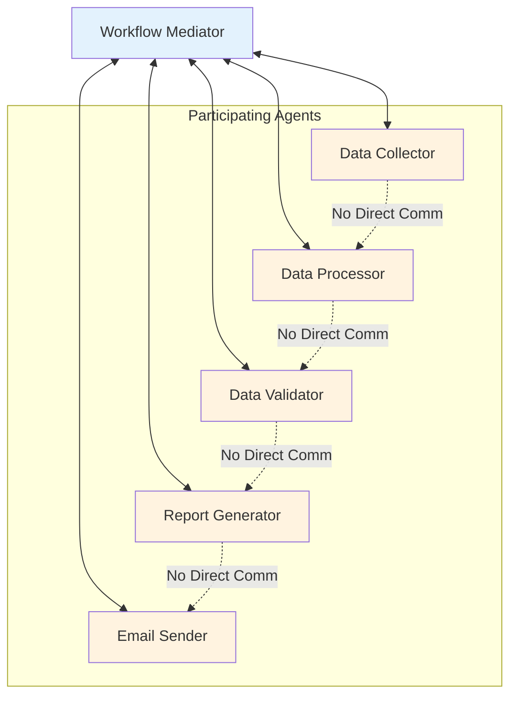
```mermaid
graph TD
    M[Workflow Mediator]

    subgraph Participating Agents
        A1[Data Collector]
        A2[Data Processor]
        A3[Data Validator]
        A4[Report Generator]
        A5[Email Sender]
    end

    M <--> A1
    M <--> A2
    M <--> A3
    M <--> A4
    M <--> A5

    %% No direct connections between agents
    A1 -.->|No Direct Comm| A2
    A2 -.->|No Direct Comm| A3
    A3 -.->|No Direct Comm| A4
    A4 -.->|No Direct Comm| A5

    style M fill:#e3f2fd
    style A1 fill:#fff3e0
    style A2 fill:#fff3e0
    style A3 fill:#fff3e0
    style A4 fill:#fff3e0
    style A5 fill:#fff3e0
```

### 13. State Machine Workflow
- Agents transition through predefined states based on conditions
- Each state may involve different agents or capabilities
- Clear progression through workflow stages
- Example: Support ticket lifecycle (New → Assigned → In Progress → Resolved)
- **Best Visualization**: State Transition Diagram

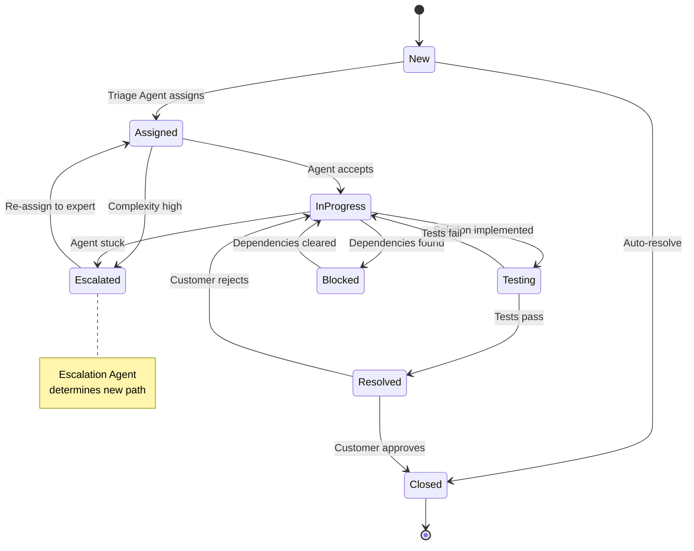
```mermaid
stateDiagram-v2
    [*] --> New
    New --> Assigned: Triage Agent assigns
    New --> Closed: Auto-resolve

    Assigned --> InProgress: Agent accepts
    Assigned --> Escalated: Complexity high

    InProgress --> Testing: Solution implemented
    InProgress --> Blocked: Dependencies found
    InProgress --> Escalated: Agent stuck

    Testing --> Resolved: Tests pass
    Testing --> InProgress: Tests fail

    Blocked --> InProgress: Dependencies cleared
    Escalated --> Assigned: Re-assign to expert

    Resolved --> Closed: Customer approves
    Resolved --> InProgress: Customer rejects

    Closed --> [*]

    note right of Escalated
        Escalation Agent
        determines new path
    end note
```

### 14. Map-Reduce Pattern
- Map phase: Distribute work across multiple parallel agents
- Reduce phase: Aggregate results from all agents
- Similar to parallel execution but with explicit aggregation step
- Good for large-scale data processing tasks
- **Best Visualization**: Swimlane Diagram (parallel lanes + convergence) or Data Flow Diagram

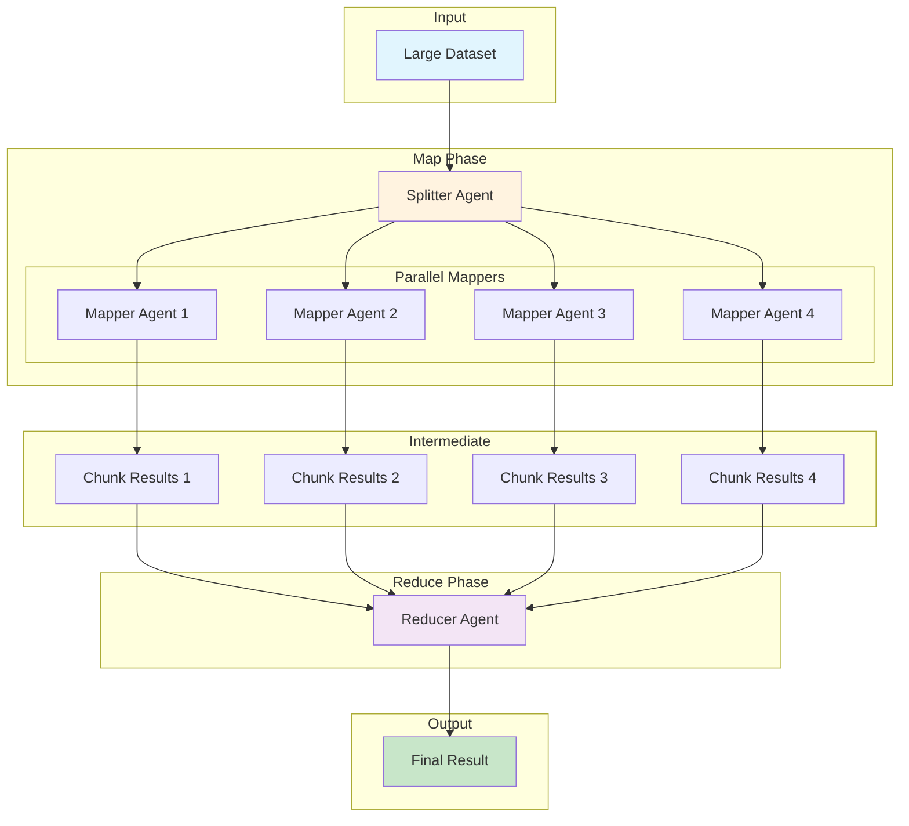
```mermaid
flowchart TD
    subgraph Input
        D[Large Dataset]
    end

    subgraph Map Phase
        S[Splitter Agent]

        subgraph Parallel Mappers
            M1[Mapper Agent 1]
            M2[Mapper Agent 2]
            M3[Mapper Agent 3]
            M4[Mapper Agent 4]
        end
    end

    subgraph Intermediate
        I1[Chunk Results 1]
        I2[Chunk Results 2]
        I3[Chunk Results 3]
        I4[Chunk Results 4]
    end

    subgraph Reduce Phase
        R[Reducer Agent]
    end

    subgraph Output
        F[Final Result]
    end

    D --> S

    S --> M1
    S --> M2
    S --> M3
    S --> M4

    M1 --> I1
    M2 --> I2
    M3 --> I3
    M4 --> I4

    I1 --> R
    I2 --> R
    I3 --> R
    I4 --> R

    R --> F

    style D fill:#e1f5fe
    style S fill:#fff3e0
    style R fill:#f3e5f5
    style F fill:#c8e6c9
```

### 15. Circuit Breaker Pattern
- Monitor agent failures and automatically switch to backup agents
- Prevents cascade failures in multi-agent systems
- Includes failure detection, fallback mechanisms, and recovery
- Important for resilient production systems
- **Best Visualization**: Architecture Diagram (system architecture with failover paths)

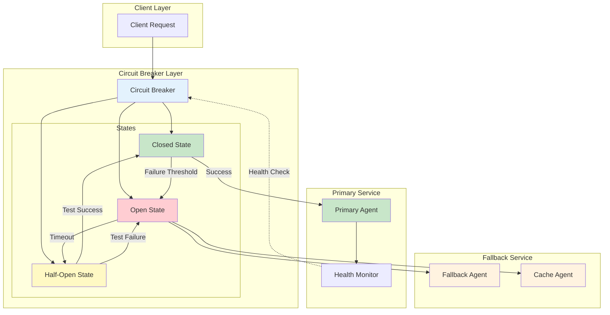
```mermaid
graph TD
    subgraph Client Layer
        C[Client Request]
    end

    subgraph Circuit Breaker Layer
        CB[Circuit Breaker]

        subgraph States
            CLOSED[Closed State]
            OPEN[Open State]
            HALF[Half-Open State]
        end
    end

    subgraph Primary Service
        PS[Primary Agent]
        HM[Health Monitor]
    end

    subgraph Fallback Service
        FB[Fallback Agent]
        CACHE[Cache Agent]
    end

    C --> CB

    CB --> CLOSED
    CB --> OPEN
    CB --> HALF

    CLOSED -->|Success| PS
    CLOSED -->|Failure Threshold| OPEN

    OPEN -->|Timeout| HALF
    OPEN --> FB
    OPEN --> CACHE

    HALF -->|Test Success| CLOSED
    HALF -->|Test Failure| OPEN

    PS --> HM
    HM -.->|Health Check| CB

    style CB fill:#e3f2fd
    style PS fill:#c8e6c9
    style FB fill:#fff3e0
    style CACHE fill:#fff3e0
    style OPEN fill:#ffcdd2
    style CLOSED fill:#c8e6c9
    style HALF fill:#fff9c4
```

## Visualization Approaches by Pattern Type

Different agent workflow patterns are best visualized using different diagram types:

### **Sequence/Flow Diagrams** (Best for temporal patterns)
- **Sequential Chain**: Simple left-to-right flow
- **Planner + Executor**: Planning phase → multiple execution flows
- **Critic and Refiner Loop**: Cyclical flow with decision points
- **State Machine Workflow**: State transition diagrams

### **Hierarchical/Tree Diagrams** (Best for delegation patterns)
- **Hierarchical Delegation**: Org chart style tree
- **Role-Based Collaboration**: Team structure with roles
- **Dynamic Agent Spawning**: Tree showing on-demand creation

### **Network/Graph Diagrams** (Best for communication patterns)
- **Negotiating Agents**: Mesh network showing voting/consensus
- **Publish-Subscribe**: Hub-and-spoke with event channels
- **Mediator Pattern**: Star topology with central mediator
- **Blackboard Pattern**: Shared central space with connected agents

### **Swimlane Diagrams** (Best for parallel/concurrent patterns)
- **Map-Reduce Pattern**: Parallel lanes for map phase, convergence for reduce
- **Bidding/Auction Pattern**: Multiple bidder lanes with auction process

### **Data Flow Diagrams (DFDs)** (Best for data transformation patterns)
- **Sequential Chain**: Clear data transformation steps
- **Map-Reduce Pattern**: Data distribution and aggregation flows
- **Recursive Orchestration**: Data flowing through decomposition/synthesis

### **Architecture Diagrams** (Best for system-level patterns)
- **Circuit Breaker Pattern**: System architecture with failover paths
- **Dynamic Agent Spawning**: Infrastructure view with resource pools

### **Hybrid Visualizations** (For complex patterns)
Many patterns benefit from **multiple diagram types**:
- **System Context Diagram** (high-level view)
- **Detailed Flow Diagram** (process steps)
- **Sequence Diagram** (temporal interactions)

### Recommended Visualization Tools
- **Mermaid**: Great for flow charts, sequence diagrams, state diagrams
- **Draw.io/Lucidchart**: Excellent for architecture and network diagrams
- **PlantUML**: Good for UML-style diagrams (sequence, class, component)
- **Graphviz**: Perfect for complex graph relationships

### Example: Multi-View Approach for Complex Patterns
For a **Role-Based Collaboration** pattern, you might use:
1. **Org Chart** (roles and hierarchy)
2. **Sequence Diagram** (temporal interactions)
3. **DFD** (data/information flow between roles)
4. **Network Diagram** (communication paths)


## [Iterative Refinement Pattern](https://google.github.io/adk-docs/agents/multi-agents/#iterative-refinement-pattern)

```
# Conceptual Code: Iterative Code Refinement
from google.adk.agents import LoopAgent, LlmAgent, BaseAgent
from google.adk.events import Event, EventActions
from google.adk.agents.invocation_context import InvocationContext
from typing import AsyncGenerator

# Agent to generate/refine code based on state['current_code'] and state['requirements']
code_refiner = LlmAgent(
    name="CodeRefiner",
    instruction="Read state['current_code'] (if exists) and state['requirements']. Generate/refine Python code to meet requirements. Save to state['current_code'].",
    output_key="current_code" # Overwrites previous code in state
)

# Agent to check if the code meets quality standards
quality_checker = LlmAgent(
    name="QualityChecker",
    instruction="Evaluate the code in state['current_code'] against state['requirements']. Output 'pass' or 'fail'.",
    output_key="quality_status"
)

# Custom agent to check the status and escalate if 'pass'
class CheckStatusAndEscalate(BaseAgent):
    async def _run_async_impl(self, ctx: InvocationContext) -> AsyncGenerator[Event, None]:
        status = ctx.session.state.get("quality_status", "fail")
        should_stop = (status == "pass")
        yield Event(author=self.name, actions=EventActions(escalate=should_stop))

refinement_loop = LoopAgent(
    name="CodeRefinementLoop",
    max_iterations=5,
    sub_agents=[code_refiner, quality_checker, CheckStatusAndEscalate(name="StopChecker")]
)
# Loop runs: Refiner -> Checker -> StopChecker
# State['current_code'] is updated each iteration.
# Loop stops if QualityChecker outputs 'pass' (leading to StopChecker escalating) or after 5 iterations.
```

## Additional Agent Workflow Patterns

### Conceptual Example: Defining Hierarchy

```python
# Conceptual Example: Defining Hierarchy
from google.adk.agents import LlmAgent, BaseAgent

# Define individual agents
greeter = LlmAgent(name="Greeter", model="gemini-2.0-flash")
task_doer = BaseAgent(name="TaskExecutor") # Custom non-LLM agent

# Create parent agent and assign children via sub_agents
coordinator = LlmAgent(
    name="Coordinator",
    model="gemini-2.0-flash",
    description="I coordinate greetings and tasks.",
    sub_agents=[ # Assign sub_agents here
        greeter,
        task_doer
    ]
)

# Framework automatically sets:
# assert greeter.parent_agent == coordinator
# assert task_doer.parent_agent == coordinator
```

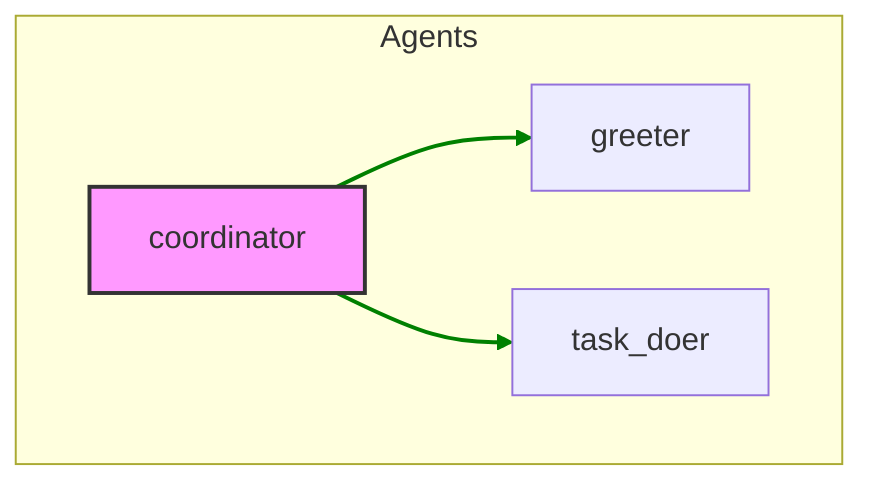
```mermaid
graph TD
    subgraph Agents
        A[greeter]
        B[task_doer]
        C[coordinator]
    end

    C --> A
    C --> B
    style C fill:#f9f,stroke:#333,stroke-width:2px
    linkStyle 0 stroke-width:2px,fill:none,stroke:green;
    linkStyle 1 stroke-width:2px,fill:none,stroke:green;
```

### Conceptual Example: Sequential Pipeline

```python
# Conceptual Example: Sequential Pipeline
from google.adk.agents import SequentialAgent, LlmAgent

step1 = LlmAgent(name="Step1_Fetch", output_key="data") # Saves output to state['data']
step2 = LlmAgent(name="Step2_Process", instruction="Process data from state key 'data'")

pipeline = SequentialAgent(name="MyPipeline", sub_agents=[step1, step2])
# When pipeline runs, Step2 can access the state['data'] set by Step1.
```

```mermaid
graph TD
    subgraph Pipeline
        A[Step1_Fetch] --> B[Step2_Process]
    end
    A --> |output_key="data"| B
    style A fill:#f9f,stroke:#333,stroke-width:2px
    style B fill:#f9f,stroke:#333,stroke-width:2px
    linkStyle 0 stroke-width:2px,fill:none,stroke:blue;
```

### Conceptual Example: Parallel Execution

```python
# Conceptual Example: Parallel Execution
from google.adk.agents import ParallelAgent, LlmAgent

fetch_weather = LlmAgent(name="WeatherFetcher", output_key="weather")
fetch_news = LlmAgent(name="NewsFetcher", output_key="news")

gatherer = ParallelAgent(name="InfoGatherer", sub_agents=[fetch_weather, fetch_news])
# When gatherer runs, WeatherFetcher and NewsFetcher run concurrently.
# A subsequent agent could read state['weather'] and state['news'].
```

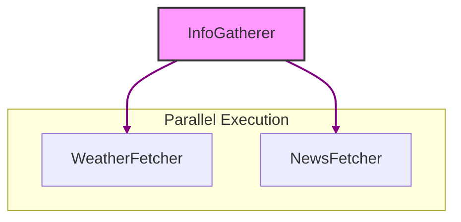
```mermaid
graph TD
    subgraph Parallel Execution
        A[WeatherFetcher]
        B[NewsFetcher]
    end
    C[InfoGatherer] --> A
    C --> B
    style C fill:#f9f,stroke:#333,stroke-width:2px
    linkStyle 0 stroke-width:2px,fill:none,stroke:purple;
    linkStyle 1 stroke-width:2px,fill:none,stroke:purple;
```

### Conceptual Example: LoopAgent

```python
from google.adk.events import Event, EventActions
from google.adk.agents.invocation_context import InvocationContext
from typing import AsyncGenerator

class CheckCondition(BaseAgent): # Custom agent to check state
    async def _run_async_impl(self, ctx: InvocationContext) -> AsyncGenerator[Event, None]:
        status = ctx.session.state.get("status", "pending")
        is_done = (status == "completed")
        yield Event(author=self.name, actions=EventActions(escalate=is_done)) # Escalate if done

process_step = LlmAgent(name="ProcessingStep") # Agent that might update state['status']

poller = LoopAgent(
    name="StatusPoller",
    max_iterations=10,
    sub_agents=[process_step, CheckCondition(name="Checker")]
)

# When poller runs, it executes process_step then Checker repeatedly
# until Checker escalates (state['status'] == 'completed') or 10 iterations pass.
```

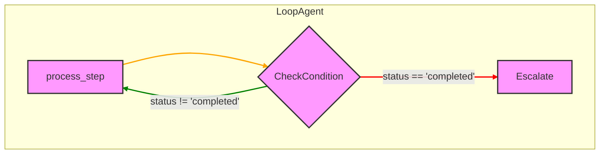
```mermaid
graph TD
    subgraph LoopAgent
        A[process_step] --> B{CheckCondition}
        B --> |"status == 'completed'"| C[Escalate]
        B --> |"status != 'completed'"| A
    end
    style A fill:#f9f,stroke:#333,stroke-width:2px
    style B fill:#f9f,stroke:#333,stroke-width:2px
    style C fill:#f9f,stroke:#333,stroke-width:2px
    linkStyle 0 stroke-width:2px,fill:none,stroke:orange;
    linkStyle 1 stroke-width:2px,fill:none,stroke:red;
    linkStyle 2 stroke-width:2px,fill:none,stroke:green;
```

### Conceptual Example: Using output_key and reading state

```python
# Conceptual Example: Using output_key and reading state
from google.adk.agents import LlmAgent, SequentialAgent

agent_A = LlmAgent(name="AgentA", instruction="Find the capital of France.", output_key="capital_city")
agent_B = LlmAgent(name="AgentB", instruction="Tell me about the city stored in state['capital_city']")

pipeline = SequentialAgent(name="CityInfo", sub_agents=[agent_A, agent_B])
# AgentA runs, saves "Paris" to state['capital_city'].
# AgentB runs, its instruction processor reads state['capital_city'] to get "Paris".
```

```mermaid
graph TD
    subgraph State Management
        A[AgentA] --> |output_key="capital_city"| State(State)
        State --> |read state['capital_city']| B[AgentB]
    end
    A --> B
    style A fill:#f9f,stroke:#333,stroke-width:2px
    style B fill:#f9f,stroke:#333,stroke-width:2px
    style State fill:#ccf,stroke:#333,stroke-width:2px
    linkStyle 0 stroke-width:2px,fill:none,stroke:darkgreen;
    linkStyle 1 stroke-width:2px,fill:none,stroke:darkblue;
    linkStyle 2 stroke-width:2px,fill:none,stroke:black;
```

### Conceptual Setup: LLM Transfer

```python
# Conceptual Setup: LLM Transfer
from google.adk.agents import LlmAgent

booking_agent = LlmAgent(name="Booker", description="Handles flight and hotel bookings.")
info_agent = LlmAgent(name="Info", description="Provides general information and answers questions.")

coordinator = LlmAgent(
    name="Coordinator",
    model="gemini-2.0-flash",
    instruction="You are an assistant. Delegate booking tasks to Booker and info requests to Info.",
    sub_agents=[booking_agent, info_agent]
)
```

```mermaid
graph TD
    subgraph LLM Transfer
        A[User Input] --> C[Coordinator]
        C --> |"Delegate booking"| B[Booker]
        C --> |"Delegate info"| D[Info]
        B --> |"Booking Result"| C
        D --> |"Info Result"| C
    end
    style A fill:#f9f,stroke:#333,stroke-width:2px
    style B fill:#f9f,stroke:#333,stroke-width:2px
    style C fill:#f9f,stroke:#333,stroke-width:2px
    style D fill:#f9f,stroke:#333,stroke-width:2px
    linkStyle 0 stroke-width:2px,fill:none,stroke:black;
    linkStyle 1 stroke-width:2px,fill:none,stroke:darkred;
    linkStyle 2 stroke-width:2px,fill:none,stroke:darkblue;
    linkStyle 3 stroke-width:2px,fill:none,stroke:darkred;
    linkStyle 4 stroke-width:2px,fill:none,stroke:darkblue;
```

### Conceptual Setup: Agent as a Tool (Image Generation Example)
```

### Conceptual Setup: Agent as a Tool (Image Generation Example)

```python
# Define a target agent (could be LlmAgent or custom BaseAgent)
from google.adk.events import Event, EventActions
from google.adk.agents.invocation_context import InvocationContext
from typing import AsyncGenerator
from google.adk.agents.agent_tool import AgentTool
from google.adk.agents import LlmAgent, BaseAgent
from google.adk import types

class ImageGeneratorAgent(BaseAgent): # Example custom agent
    name: str = "ImageGen"
    description: str = "Generates an image based on a prompt."
    # ... internal logic ...
    async def _run_async_impl(self, ctx: InvocationContext) -> AsyncGenerator[Event, None]:
        prompt = ctx.session.state.get("image_prompt", "default prompt")
        # ... generate image bytes ...
        image_bytes = b"..."
        yield Event(author=self.name, content=types.Content(parts=[types.Part.from_bytes(image_bytes, mime_type="image/png")]))

image_agent = ImageGeneratorAgent()
image_tool = AgentTool(agent=image_agent) # Wrap the agent

# Parent agent uses the AgentTool
artist_agent = LlmAgent(
    name="Artist",
    model="gemini-2.0-flash",
    instruction="Create a prompt and use the ImageGen tool to generate the image.",
    tools=[image_tool] # Include the AgentTool
)

# Artist LLM generates a prompt, then calls:
# FunctionCall(name='ImageGen', args={'image_prompt': 'a cat wearing a hat'})
# Framework calls image_tool.run_async(...), which runs ImageGeneratorAgent.
# The resulting image Part is returned to the Artist agent as the tool result.
```

```mermaid
graph TD
    subgraph Agent as a Tool
        A[User Input] --> B[Artist Agent (LLM)]
        B --> |"FunctionCall: ImageGen"| C[ImageGeneratorAgent (Tool)]
        C --> |"Image Bytes"| B
        B --> D[Generated Image]
    end
    style A fill:#f9f,stroke:#333,stroke-width:2px
    style B fill:#f9f,stroke:#333,stroke-width:2px
    style C fill:#f9f,stroke:#333,stroke-width:2px
    style D fill:#f9f,stroke:#333,stroke-width:2px
    linkStyle 0 stroke-width:2px,fill:none,stroke:black;
    linkStyle 1 stroke-width:2px,fill:none,stroke:darkgreen;
    linkStyle 2 stroke-width:2px,fill:none,stroke:darkblue;
    linkStyle 3 stroke-width:2px,fill:none,stroke:black;
```

## Custom Agents

### StoryFlowAgent Example

```python
class StoryFlowAgent(BaseAgent):
    """
    Custom agent for a story generation and refinement workflow.

    This agent orchestrates a sequence of LLM agents to generate a story,
    critique it, revise it, check grammar and tone, and potentially
    regenerate the story if the tone is negative.
    """

    # --- Field Declarations for Pydantic ---
    # Declare the agents passed during initialization as class attributes with type hints.
    # This allows the BaseAgent framework to recognize them as sub-agents.
    story_generator: LlmAgent
    critique_agent: LlmAgent
    revision_agent: LlmAgent
    grammar_checker: LlmAgent
    tone_checker: LlmAgent

    def __init__(self, **kwargs):
        super().__init__(**kwargs)
        # You can also store other non-agent attributes here if needed
        self.max_refinement_iterations = 3

    async def _run_async_impl(self, ctx: InvocationContext) -> AsyncGenerator[Event, None]:
        # Initial story generation
        story = await self.story_generator.run_async(ctx, instruction="Generate a short story.")
        ctx.session.state["current_story"] = story.result

        for i in range(self.max_refinement_iterations):
            # Critique the story
            critique = await self.critique_agent.run_async(
                ctx, instruction=f"Critique the following story: {ctx.session.state['current_story']}"
            )
            ctx.session.state["current_critique"] = critique.result

            # Revise the story based on critique
            revised_story = await self.revision_agent.run_async(
                ctx,
                instruction=f"Revise the story based on this critique: {ctx.session.state['current_critique']}\nStory: {ctx.session.state['current_story']}"
            )
            ctx.session.state["current_story"] = revised_story.result

            # Check grammar
            grammar_check = await self.grammar_checker.run_async(
                ctx, instruction=f"Check grammar of: {ctx.session.state['current_story']}"
            )
            ctx.session.state["grammar_feedback"] = grammar_check.result

            # Check tone
            tone_check = await self.tone_checker.run_async(
                ctx, instruction=f"Analyze the tone of: {ctx.session.state['current_story']}. Is it positive, neutral, or negative?"
            )
            ctx.session.state["tone_feedback"] = tone_check.result

            yield Event(author=self.name, content=f"Iteration {i+1} complete.")

            if ctx.session.state["tone_feedback"].lower() == "negative":
                yield Event(author=self.name, content="Tone is negative, regenerating story.")
                # Regenerate story if tone is negative
                story = await self.story_generator.run_async(ctx, instruction="Regenerate a short story with a positive tone.")
                ctx.session.state["current_story"] = story.result
            else:
                break # Exit loop if tone is not negative

        yield Event(author=self.name, content=f"Final Story: {ctx.session.state['current_story']}")
        yield Event(author=self.name, content=f"Final Grammar Feedback: {ctx.session.state['grammar_feedback']}")
        yield Event(author=self.name, content=f"Final Tone Feedback: {ctx.session.state['tone_feedback']}")
```

```mermaid
graph TD
    subgraph StoryFlowAgent Workflow
        A[Start: Generate Initial Story] --> B{Critique Story}
        B --> C[Revise Story]
        C --> D[Check Grammar]
        D --> E[Check Tone]
        E --> |"Tone is Negative"| A
        E --> |"Tone is Positive/Neutral"| F[End: Final Story]
    end
    style A fill:#f9f,stroke:#333,stroke-width:2px
    style B fill:#f9f,stroke:#333,stroke-width:2px
    style C fill:#f9f,stroke:#333,stroke-width:2px
    style D fill:#f9f,stroke:#333,stroke-width:2px
    style E fill:#f9f,stroke:#333,stroke-width:2px
    style F fill:#f9f,stroke:#333,stroke-width:2px
    linkStyle 0 stroke-width:2px,fill:none,stroke:black;
    linkStyle 1 stroke-width:2px,fill:none,stroke:black;
    linkStyle 2 stroke-width:2px,fill:none,stroke:black;
    linkStyle 3 stroke-width:2px,fill:none,stroke:black;
    linkStyle 4 stroke-width:2px,fill:none,stroke:red;
    linkStyle 5 stroke-width:2px,fill:none,stroke:green;
```

## Workflow Agents

### Sequential Agents: Code Development Pipeline

```python
# Part of agent.py --> Follow https://google.github.io/adk-docs/get-started/quickstart/ to learn the full agent.py
# --- 1. Define Sub-Agents for Each Pipeline Stage ---

# Code Writer Agent
# Takes the initial specification (from user query) and writes code.
code_writer_agent = LlmAgent(
    name="CodeWriterAgent",
    model=GEMINI_MODEL,
    # Change 3: Improved instruction
    instruction="""You are a Python Code Generator.
    Your goal is to write Python code based on the user's request.
    Focus on writing clean, readable, and functional code.
    If the user provides existing code, refine it based on their instructions.
    """
)

# Code Reviewer Agent
# Reviews the code generated by the Code Writer Agent.
code_reviewer_agent = LlmAgent(
    name="CodeReviewerAgent",
    model=GEMINI_MODEL,
    # Change 4: Improved instruction
    instruction="""You are a Python Code Reviewer.
    Your goal is to review Python code for quality, adherence to best practices, and correctness.
    Provide constructive feedback and suggest improvements.
    If the code is good, simply state 'Looks good!'.
    """
)

# Code Refactorer Agent
# Refactors the code based on the reviewer's comments.
code_refactorer_agent = LlmAgent(
    name="CodeRefactorerAgent",
    model=GEMINI_MODEL,
    # Change 5: Improved instruction
    instruction="""You are a Python Code Refactorer.
    Your goal is to refactor Python code based on provided feedback and suggestions.
    Ensure the refactored code is clean, efficient, and addresses all comments.
    """
)

# --- 2. Define the SequentialAgent Pipeline ---
# The SequentialAgent orchestrates the execution of sub-agents in a fixed order.
# The output of each sub-agent is passed to the next via state.
code_pipeline = SequentialAgent(
    name="CodeDevelopmentPipeline",
    sub_agents=[
        code_writer_agent,
        code_reviewer_agent,
        code_refactorer_agent
    ]
)

# --- 3. Define the main agent's _run_async_impl method ---
# This method orchestrates the sub-agents using standard Python async/await and control flow.
# It passes data between sub-agents using ctx.session.state.
async def _run_async_impl(self, ctx: InvocationContext) -> AsyncGenerator[Event, None]:
    # Initial code generation based on user query
    initial_code_request = ctx.session.state.get("user_query")
    if not initial_code_request:
        yield Event(author=self.name, content="No user query provided for code generation.")
        return

    # Run the code development pipeline
    pipeline_result = await code_pipeline.run_async(
        ctx, instruction=initial_code_request
    )

    # The final output of the pipeline (from code_refactorer_agent) is in pipeline_result.result
    final_code = pipeline_result.result
    yield Event(author=self.name, content=f"Final Generated Code:\n```python\n{final_code}\n```")

    # You can also access intermediate results from state if needed
    # writer_output = ctx.session.state.get("CodeWriterAgent_output")
    # reviewer_output = ctx.session.state.get("CodeReviewerAgent_output")
```

```mermaid
graph TD
    subgraph Code Development Pipeline
        A[User Query] --> B[CodeWriterAgent]
        B --> C[CodeReviewerAgent]
        C --> D[CodeRefactorerAgent]
        D --> E[Final Generated Code]
    end
    style A fill:#f9f,stroke:#333,stroke-width:2px
    style B fill:#f9f,stroke:#333,stroke-width:2px
    style C fill:#f9f,stroke:#333,stroke-width:2px
    style D fill:#f9f,stroke:#333,stroke-width:2px
    style E fill:#f9f,stroke:#333,stroke-width:2px
    linkStyle 0 stroke-width:2px,fill:none,stroke:black;
    linkStyle 1 stroke-width:2px,fill:none,stroke:black;
    linkStyle 2 stroke-width:2px,fill:none,stroke:black;
    linkStyle 3 stroke-width:2px,fill:none,stroke:black;
```

### Parallel Agents: Parallel Web Research

```python
# Part of agent.py --> Follow https://google.github.io/adk-docs/get-started/quickstart/ to learn the full agent.py
# --- 1. Define Researcher Sub-Agents (to run in parallel) ---

# Researcher 1: Renewable Energy
researcher_agent_1 = LlmAgent(
    name="RenewableEnergyResearcher",
    model=GEMINI_MODEL,
    instruction="""You are an AI Research Assistant specializing in energy.
    Research the latest advancements in 'renewable energy sources'.
    Use the Google Search tool provided.
    Summarize your key findings concisely (1-2 sentences).
    Output *only* the summary.
    """
)

# Researcher 2: Electric Vehicle Technology
researcher_agent_2 = LlmAgent(
    name="ElectricVehicleResearcher",
    model=GEMINI_MODEL,
    instruction="""You are an AI Research Assistant specializing in automotive technology.
    Research the latest advancements in 'electric vehicle technology'.
    Use the Google Search tool provided.
    Summarize your key findings concisely (1-2 sentences).
    Output *only* the summary.
    """
)

# Researcher 3: Carbon Capture Methods
researcher_agent_3 = LlmAgent(
    name="CarbonCaptureResearcher",
    model=GEMINI_MODEL,
    instruction="""You are an AI Research Assistant specializing in environmental science.
    Research the latest advancements in 'carbon capture methods'.
    Use the Google Search tool provided.
    Summarize your key findings concisely (1-2 sentences).
    Output *only* the summary.
    """
)

# --- 2. Define the ParallelAgent ---
# The ParallelAgent orchestrates the concurrent execution of sub-agents.
# All sub-agents run simultaneously, and their results are collected.
parallel_research_agent = ParallelAgent(
    name="ParallelResearchAgent",
    sub_agents=[
        researcher_agent_1,
        researcher_agent_2,
        researcher_agent_3
    ]
)

# --- 3. Define the main agent's _run_async_impl method ---
# This method orchestrates the sub-agents using standard Python async/await and control flow.
# It collects results from the parallel execution.
async def _run_async_impl(self, ctx: InvocationContext) -> AsyncGenerator[Event, None]:
    # Run the parallel research
    research_results = await parallel_research_agent.run_async(ctx)

    # Collect and present results from all parallel sub-agents
    yield Event(author=self.name, content="Parallel Research Results:")
    for i, result in enumerate(research_results.results):
        yield Event(author=self.name, content=f"Researcher {i+1} Summary: {result.result}")

    # You can also access intermediate results from state if needed
    # renewable_summary = research_results.results_by_name["RenewableEnergyResearcher"].result
    # ev_summary = research_results.results_by_name["ElectricVehicleResearcher"].result
```

```mermaid
graph TD
    subgraph Parallel Web Research
        A[User Query] --> B[ParallelResearchAgent]
        B --> C[Researcher 1]
        B --> D[Researcher 2]
        B --> E[Researcher 3]
        C --> F[Summary 1]
        D --> G[Summary 2]
        E --> H[Summary 3]
        F & G & H --> I[Combined Results]
    end
    style A fill:#f9f,stroke:#333,stroke-width:2px
    style B fill:#f9f,stroke:#333,stroke-width:2px
    style C fill:#f9f,stroke:#333,stroke-width:2px
    style D fill:#f9f,stroke:#333,stroke-width:2px
    style E fill:#f9f,stroke:#333,stroke-width:2px
    style F fill:#f9f,stroke:#333,stroke-width:2px
    style G fill:#f9f,stroke:#333,stroke-width:2px
    style H fill:#f9f,stroke:#333,stroke-width:2px
    style I fill:#f9f,stroke:#333,stroke-width:2px
    linkStyle 0 stroke-width:2px,fill:none,stroke:black;
    linkStyle 1 stroke-width:2px,fill:none,stroke:black;
    linkStyle 2 stroke-width:2px,fill:none,stroke:black;
    linkStyle 3 stroke-width:2px,fill:none,stroke:black;
    linkStyle 4 stroke-width:2px,fill:none,stroke:black;
    linkStyle 5 stroke-width:2px,fill:none,stroke:black;
    linkStyle 6 stroke-width:2px,fill:none,stroke:black;
    linkStyle 7 stroke-width:2px,fill:none,stroke:black;
    linkStyle 8 stroke-width:2px,fill:none,stroke:black;
```

### Loop Agents: Iterative Document Improvement

```python
# Part of agent.py --> Follow https://google.github.io/adk-docs/get-started/quickstart/ to learn the full agent.py
import asyncio
import os

from google.adk.agents import LoopAgent, LlmAgent, BaseAgent, SequentialAgent
from google.genai import types
from google.adk.runners import InMemoryRunner
from google.adk.agents.invocation_context import InvocationContext
from google.adk.tools.tool_context import ToolContext
from typing import AsyncGenerator, Optional
from google.adk.events import Event, EventActions

# --- Constants ---
APP_NAME = "doc_writing_app_v3" # New App Name
USER_ID = "dev_user_01"
SESSION_ID_BASE = "loop_exit_tool_session" # New Base Session ID
GEMINI_MODEL = "gemini-2.0-flash"
STATE_INITIAL_TOPIC = "initial_topic"

# --- 1. Define Sub-Agents for the Loop ---

# Writer Agent: Generates or refines a draft on a topic.
writer_agent = LlmAgent(
    name="WriterAgent",
    model=GEMINI_MODEL,
    instruction="""You are a document writer.
    Your goal is to write or refine a document based on the provided topic and feedback.
    If a draft exists in state['current_draft'], refine it. Otherwise, generate a new draft.
    Focus on clarity, completeness, and addressing all critique.
    Output *only* the refined or new document.
    """
)

# Critic Agent: Critiques the draft, identifying areas for improvement.
critic_agent = LlmAgent(
    name="CriticAgent",
    model=GEMINI_MODEL,
    instruction="""You are a document critic.
    Your goal is to critique the provided document for clarity, completeness, and grammar.
    Provide constructive feedback and suggest improvements.
    If the document is excellent and requires no changes, simply state 'Looks good!'.
    Output *only* the critique or the 'Looks good!' statement.
    """
)

# --- 2. Define the LoopAgent ---
# The LoopAgent repeatedly executes its sub-agents until a termination condition is met.
# In this case, the loop continues until the CriticAgent says "Looks good!" or max_iterations is reached.
document_improvement_loop = LoopAgent(
    name="DocumentImprovementLoop",
    sub_agents=[
        writer_agent,
        critic_agent
    ],
    max_iterations=5 # Max iterations to prevent infinite loops
)

# --- 3. Define the main agent's _run_async_impl method ---
# This method orchestrates the loop and handles the initial setup and final output.
async def _run_async_impl(self, ctx: InvocationContext) -> AsyncGenerator[Event, None]:
    # Initial topic from user query
    initial_topic = ctx.session.state.get("user_query", STATE_INITIAL_TOPIC)
    if not initial_topic:
        yield Event(author=self.name, content="No topic provided for document generation.")
        return

    # Run the document improvement loop
    loop_result = await document_improvement_loop.run_async(
        ctx, instruction=f"Generate a document on: {initial_topic}"
    )

    # The final output of the loop (from the last agent in the loop) is in loop_result.result
    final_document = ctx.session.state.get("current_draft") # Assuming writer_agent saves to current_draft
    final_critique = ctx.session.state.get("CriticAgent_output") # Assuming critic_agent saves its output

    yield Event(author=self.name, content=f"Final Document:\n```\n{final_document}\n```")
    yield Event(author=self.name, content=f"Final Critique: {final_critique}")

    # You can also check if the loop terminated due to max_iterations or a successful critique
    if loop_result.is_terminated_by_max_iterations:
        yield Event(author=self.name, content="Loop terminated due to max iterations.")
    elif "looks good" in final_critique.lower():
        yield Event(author=self.name, content="Document approved by critic.")
```

```mermaid
graph TD
    subgraph Iterative Document Improvement
        A[Start: Initial Topic] --> B[WriterAgent]
        B --> C[CriticAgent]
        C --> |"Looks good!"| D[End: Final Document]
        C --> |"Needs improvement"| B
    end
    style A fill:#f9f,stroke:#333,stroke-width:2px
    style B fill:#f9f,stroke:#333,stroke-width:2px
    style C fill:#f9f,stroke:#333,stroke-width:2px
    style D fill:#f9f,stroke:#333,stroke-width:2px
    linkStyle 0 stroke-width:2px,fill:none,stroke:black;
    linkStyle 1 stroke-width:2px,fill:none,stroke:black;
    linkStyle 2 stroke-width:2px,fill:none,stroke:green;
    linkStyle 3 stroke-width:2px,fill:none,stroke:red;
```

## RAG Agent

### Build a RAG Agent using Google ADK and Vertex AI RAG Engine

```python
# rag/config/__init__.py
# Project and location settings
PROJECT_ID = "your-project-id"  # Your Google Cloud project ID
LOCATION = "us-central1"      # Google Cloud region

# RAG configuration defaults
RAG_DEFAULT_EMBEDDING_MODEL = "text-embedding-004" # Default embedding model
RAG_DEFAULT_TOP_K = 10
RAG_DEFAULT_SEARCH_TOP_K = 5
RAG_DEFAULT_VECTOR_DISTANCE_THRESHOLD = 0.5 # Similarity threshold
RAG_DEFAULT_PAGE_SIZE = 50 # Default pagination size for listing operations

# GCS configuration defaults
GCS_DEFAULT_STORAGE_CLASS = "STANDARD" # Standard storage class for buckets
GCS_DEFAULT_LOCATION = "US" # Multi-regional location for buckets
GCS_DEFAULT_CONTENT_TYPE = "application/pdf" # Default content type for uploads
GCS_LIST_BUCKETS_MAX_RESULTS = 50 # Max results for bucket listing
GCS_LIST_BLOBS_MAX_RESULTS = 100 # Max results for blob listing

# Logging configuration
LOG_LEVEL = "INFO"
LOG_FORMAT = "%(asctime)s - %(name)s - %(levelname)s - %(message)s"
```

```python
# rag/tools/corpus_tools.py
def create_rag_corpus(
    display_name: str,
    description: Optional[str] = None,
    embedding_model: Optional[str] = None
) -> Dict[str, Any]:
    """
    Creates a new RAG corpus in Vertex AI.

    Args:
        display_name: A human-readable name for the corpus
        description: Optional description for the corpus
        embedding_model: The embedding model to use (default: text-embedding-004)

    Returns:
        A dictionary containing the created corpus details including:
        - name: The full resource name of the corpus
        - display_name: The human-readable name
        - description: The description
        - create_time: The creation timestamp
        - update_time: The last update timestamp
    """
    if embedding_model is None:
        embedding_model = RAG_DEFAULT_EMBEDDING_MODEL
    try:
        # Configure embedding model
        embedding_model_config = rag.EmbeddingModelConfig(
            publisher_model=f"publishers/google/models/{embedding_model}"
        )

        # Create the corpus
        corpus = rag.create_corpus(
            display_name=display_name,
            description=description or f"RAG corpus: {display_name}",
            embedding_model_config=embedding_model_config,
        )

        # Extract corpus ID from the full name
        corpus_id = corpus.name.split('/')[-1]

        return {
            "status": "success",
            "corpus_name": corpus.name,
            "corpus_id": corpus_id,
            "display_name": corpus.display_name,
            "message": f"Successfully created RAG corpus '{display_name}'"
        }
    except Exception as e:
        return {
            "status": "error",
            "error_message": str(e),
            "message": f"Failed to create RAG corpus: {str(e)}"
        }

# Create FunctionTools from the functions for the RAG corpus management tools
create_corpus_tool = FunctionTool(create_rag_corpus)
update_corpus_tool = FunctionTool(update_rag_corpus)
list_corpora_tool = FunctionTool(list_rag_corpora)
get_corpus_tool = FunctionTool(get_rag_corpus)
delete_corpus_tool = FunctionTool(delete_rag_corpus)
import_document_tool = FunctionTool(import_document_to_corpus)

# Create FunctionTools from the functions for the RAG file management tools
list_files_tool = FunctionTool(list_rag_files)
get_file_tool = FunctionTool(get_rag_file)
delete_file_tool = FunctionTool(delete_rag_file)

# Create FunctionTools from the functions for the RAG query tools
query_rag_corpus_tool = FunctionTool(query_rag_corpus)
search_all_corpora_tool = FunctionTool(search_all_corpora)
process_grounding_metadata_tool = FunctionTool(process_grounding_metadata)
```

```python
# rag/tools/storage_tools.py
def upload_file_to_gcs(
    tool_context: ToolContext,
    bucket_name: str,
    file_artifact_name: str,
    destination_blob_name: Optional[str] = None,
    content_type: Optional[str] = None
) -> Dict[str, Any]:
    """Uploads a file from ADK artifacts to a Google Cloud Storage bucket."""
    if content_type is None:
        content_type = GCS_DEFAULT_CONTENT_TYPE
    try:
        # Check if user_content contains a file attachment
        if (hasattr(tool_context, "user_content") and
                tool_context.user_content and
                tool_context.user_content.parts):
            # Look for any file in parts
            file_data = None
            for part in tool_context.user_content.parts:
                if hasattr(part, "inline_data") and part.inline_data:
                    if part.inline_data.mime_type.startswith("application/"):
                        file_data = part.inline_data.data
                        break
            if file_data:
                # We found file data in the user message
                if not destination_blob_name:
                    destination_blob_name = file_artifact_name
                if content_type == "application/pdf" and not destination_blob_name.endswith(".pdf"):
                    destination_blob_name += ".pdf"
                # Upload to GCS
                client = storage.Client(project=PROJECT_ID)
                bucket = client.bucket(bucket_name)
                blob = bucket.blob(destination_blob_name)

                blob.upload_from_string(
                    data=file_data,
                    content_type=content_type
                )
```

```python
# rag/agent.py
# Create the RAG management agent
rag_agent = LlmAgent(
    name="RAGManager",
    description="A RAG agent that can manage corpora and files, and answer questions using RAG.",
    model="gemini-2.0-flash",
    tools=[
        create_corpus_tool,
        update_corpus_tool,
        list_corpora_tool,
        get_corpus_tool,
        delete_corpus_tool,
        import_document_tool,
        list_files_tool,
        get_file_tool,
        delete_file_tool,
        query_rag_corpus_tool,
        search_all_corpora_tool,
        process_grounding_metadata_tool,
        # Add storage tools
        create_bucket_tool,
        list_buckets_tool,
        upload_file_gcs_tool,
        list_blobs_tool,
    ],
)
```

```mermaid
graph TD
    subgraph RAG Agent Workflow
        A[User Query] --> B[RAG Agent]
        B --> |"GCS Operations"| C[Storage Tools]
        B --> |"RAG Operations"| D[RAG Corpus Tools]
        C --> E[Google Cloud Storage]
        D --> F[Vertex AI RAG Engine]
        F --> G[Vector DB & Embedding Models]
        F --> B
        E --> F
    end
    style A fill:#f9f,stroke:#333,stroke-width:2px
    style B fill:#f9f,stroke:#333,stroke-width:2px
    style C fill:#f9f,stroke:#333,stroke-width:2px
    style D fill:#f9f,stroke:#333,stroke-width:2px
    style E fill:#f9f,stroke:#333,stroke-width:2px
    style F fill:#f9f,stroke:#333,stroke-width:2px
    style G fill:#f9f,stroke:#333,stroke-width:2px
    linkStyle 0 stroke-width:2px,fill:none,stroke:black;
    linkStyle 1 stroke-width:2px,fill:none,stroke:black;
    linkStyle 2 stroke-width:2px,fill:none,stroke:black;
    linkStyle 3 stroke-width:2px,fill:none,stroke:black;
    linkStyle 4 stroke-width:2px,fill:none,stroke:black;
    linkStyle 5 stroke-width:2px,fill:none,stroke:black;
    linkStyle 6 stroke-width:2px,fill:none,stroke:black;
```

# Project: ADK Bidirectional Streaming Application

Workflow Requirements Document example. Adding a Data Flow Diagram would help.

```
# Project: ADK Bidirectional Streaming Application

## Goal
- Build a bidirectional streamping app with Google ADK (Agent Development Kit)

## Tech Stack
- Server:
  - FastAPI
  - Google ADK (Agent Development Kit)
  - SSE communication
- Client:
  - Web client a JS based UI
  - SSE communication

## Requirements
- Reference: Use the GitHub MCP server to read the following resources on GitHub to learn how to use
ADK:
  - examples/python/snippets/streaming/adk-streaming/ from the google/adk-docs repository
  - docs/streaming/custom-streaming.md from the google/adk-docs repository
- Environment:
  - Use Python venv to install and run the server
  - Check if .env exists. If not, create one
  - Set SSL_CERT_FILE variable before running the server, as explained in the doc
  - Kill any processes that uses the port number

## Tests
- Create and run a test client that ask a question "What time is it?" and verifies it receives the
current time from the agent. Run the test to make sure the server works as expected

## Deployment
- Explain to the developer how to access the app from the browser

## Success
- Make sure the test client runs without any errors
```
