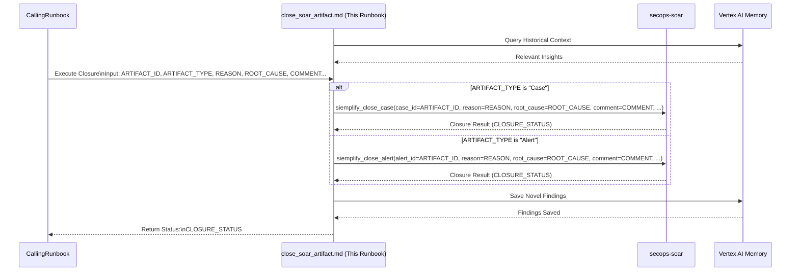

# Common Step: Close SOAR Case or Alert

## Objective

Close a specified SOAR case or alert with the required reason, root cause, and comment.

## Scope

This sub-runbook executes the appropriate SOAR closure action (`siemplify_close_case` or `siemplify_close_alert`) based on the provided artifact type.

## Inputs

*   `${ARTIFACT_ID}`: The ID of the SOAR case or alert to close.
*   `${ARTIFACT_TYPE}`: The type of artifact ("Case" or "Alert").
*   `${CLOSURE_REASON}`: The reason for closure. Must be one of the predefined enum values: `MALICIOUS`, `NOT_MALICIOUS`, `MAINTENANCE`, `INCONCLUSIVE`, `UNKNOWN`.
*   `${ROOT_CAUSE}`: The root cause for closure. *(Must match a predefined root cause string configured in the SOAR settings. Use the `soar-mcp_get_case_settings_root_causes` tool to list available root causes if needed.)*
*   `${CLOSURE_COMMENT}`: A comment detailing the closure justification.
*   *(Optional) `${ALERT_GROUP_IDENTIFIERS}`: Relevant alert group identifiers if required by the specific SOAR tool implementation, passed from the calling runbook.*
*   *(Optional, for `siemplify_close_alert`) `${ASSIGN_TO_USER}`: User to assign the closed alert to.*
*   *(Optional, for `siemplify_close_alert`) `${TAGS}`: Comma-separated tags for the closed alert.*

## Outputs

*   `${CLOSURE_STATUS}`: Confirmation or status of the closure attempt (e.g., Success, Failure, API response).

## Tools

*   `secops-soar`: `siemplify_close_case`, `siemplify_close_alert`

## Workflow Steps & Diagram

> **Query Memory Context:** Before deep analysis, use the `LoadMemoryTool` to retrieve historical context for the involved entities or alert types. Check appropriate topics such as `approved_exceptions`, `investigation_patterns`, or `asset_context` to avoid redundant effort and identify known benign behavior.

1.  **Receive Input:** Obtain `${ARTIFACT_ID}`, `${ARTIFACT_TYPE}`, `${CLOSURE_REASON}`, `${ROOT_CAUSE}`, `${CLOSURE_COMMENT}`, and other optional inputs from the calling runbook.
2.  **Execute Closure:**
    *   If `${ARTIFACT_TYPE}` is "Case":
        *   Call `soar-mcp_siemplify_close_case` with `case_id=${ARTIFACT_ID}`, `reason=${CLOSURE_REASON}`, `root_cause=${ROOT_CAUSE}`, `comment=${CLOSURE_COMMENT}` (and `alert_group_identifiers` if needed).
    *   If `${ARTIFACT_TYPE}` is "Alert":
        *   Call `soar-mcp_siemplify_close_alert` with `case_id` (if applicable, often the parent case ID), `alert_id=${ARTIFACT_ID}`, `reason=${CLOSURE_REASON}`, `root_cause=${ROOT_CAUSE}`, `comment=${CLOSURE_COMMENT}`, and optional `assign_to_user`, `tags` (and `alert_group_identifiers` if needed). *Note: The exact parameters for `siemplify_close_alert` might need adjustment based on the specific tool definition.*
3.  **Return Status:** Store the result/status of the API call in `${CLOSURE_STATUS}` and return it to the calling runbook.

> **Save Findings to Memory:** If this workflow yielded novel insights (e.g., a new false positive rule, newly identified critical infrastructure, or a successful containment action), save these details to the memory bank under the appropriate topic (e.g., `analyst_notes`, `detection_rule_feedback`, or `containment_strategies`).

## Completion Criteria

The appropriate closure action (`siemplify_close_case` or `siemplify_close_alert`) has been attempted. The status (`${CLOSURE_STATUS}`) is available.
