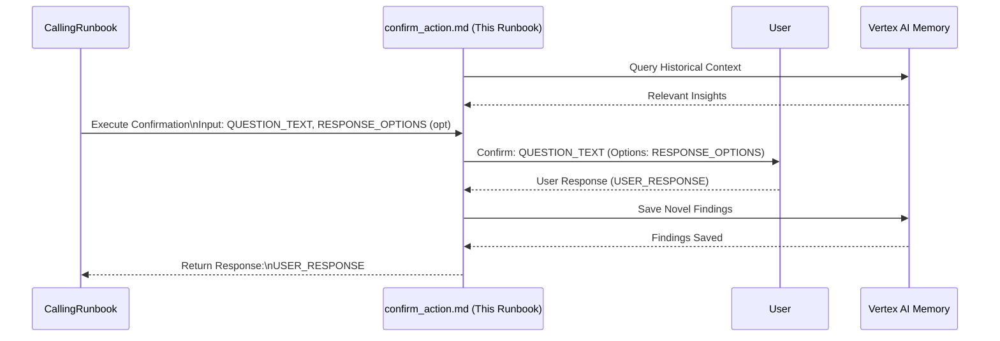

# Common Step: Confirm Action with User

## Objective

Ask the user a follow-up question to confirm whether a specific action should be taken before proceeding.

## Scope

This sub-runbook executes the You may ask follow up question tool with a provided question and optional response options. It returns the user's response to the calling runbook.

## Inputs

*   `${QUESTION_TEXT}`: The specific question to ask the user (e.g., "Isolate endpoint ENDPOINT_ID?", "Proceed with containment for IOC_VALUE?").
*   *(Optional) `${RESPONSE_OPTIONS}`: A list of predefined options for the user to choose from (e.g., ["Yes", "No"], ["Disable Account", "Reset Password", "Monitor Only"]).*

## Outputs

*   `${USER_RESPONSE}`: The response provided by the user to the question.

## Tools

*   You may ask follow up question

## Workflow Steps & Diagram

> **Query Memory Context:** Before deep analysis, use the `LoadMemoryTool` to retrieve historical context for the involved entities or alert types. Check appropriate topics such as `approved_exceptions`, `investigation_patterns`, or `asset_context` to avoid redundant effort and identify known benign behavior.

1.  **Receive Input:** Obtain `${QUESTION_TEXT}` and optionally `${RESPONSE_OPTIONS}` from the calling runbook.
2.  **Ask Question:** Call You may ask follow up question with `question=${QUESTION_TEXT}` and `options=${RESPONSE_OPTIONS}` (if provided).
3.  **Return Response:** Store the user's response in `${USER_RESPONSE}` and return it to the calling runbook.

> **Save Findings to Memory:** If this workflow yielded novel insights (e.g., a new false positive rule, newly identified critical infrastructure, or a successful containment action), save these details to the memory bank under the appropriate topic (e.g., `analyst_notes`, `detection_rule_feedback`, or `containment_strategies`).

## Completion Criteria

The You may ask follow up question action has been executed. The user's response (`${USER_RESPONSE}`) is available.
