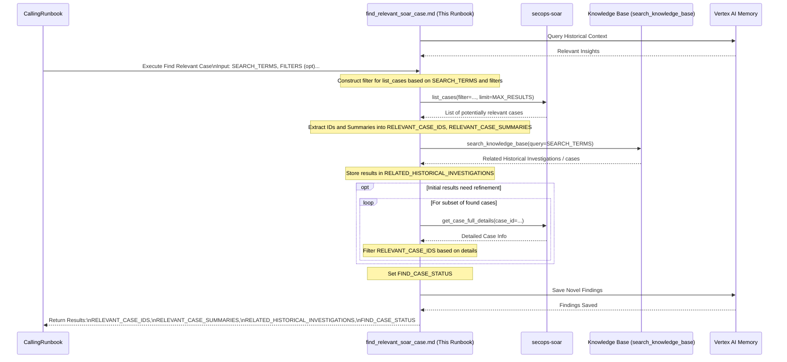

# Common Step: Find Relevant SOAR Cases and Historical Investigations

## Objective

Identify existing SOAR cases and historical investigations that are potentially relevant to the current investigation based on specific indicators (e.g., IOCs, hostnames, usernames).

## Scope

This sub-runbook executes searches within the SOAR platform's case list and the Elasticsearch index containing past/harvested investigations. It returns a list of active or closed SOAR case IDs, as well as relevant historical investigation reports.

## Inputs

*   `${SEARCH_TERMS}`: A list of values to search for (e.g., ["e323c6aee8b172b57203a7e478c1caca", "mikeross-pc"]).
*   *(Optional) `${SEARCH_FIELDS}`: A list of fields to search within (e.g., ["entity", "displayName", "description"]). Defaults may vary based on SOAR capabilities.*
*   *(Optional) `${CASE_STATUS_FILTER}`: Filter for case status (e.g., "Opened", "Closed"). Defaults to "Opened".*
*   *(Optional) `${TIME_FRAME_HOURS}`: Lookback period for case creation/update time (if supported by the filter).*
*   *(Optional) `${MAX_RESULTS}`: Maximum number of cases to return.*

## Outputs

*   `${RELEVANT_CASE_IDS}`: A list of case IDs identified as potentially relevant.
*   `${RELEVANT_CASE_SUMMARIES}`: A list of brief summaries (ID, DisplayName, Priority) for the found cases.
*   `${RELATED_HISTORICAL_INVESTIGATIONS}`: A list of related historical investigations/reports retrieved from the knowledge base.
*   `${FIND_CASE_STATUS}`: Confirmation or status of the search attempt(s).

## Tools

*   `secops-soar`: `list_cases`
*   `orchestrator`: `search_knowledge_base` (used to query the historical cases, alerts, and investigations knowledge base)
*   *(Optional) `secops-soar`: `get_case_full_details` (Potentially used internally if initial list is large and needs filtering based on deeper entity checks)*

## Workflow Steps & Diagram

> **Query Memory Context:** Before deep analysis, use the `LoadMemoryTool` to retrieve historical context for the involved entities or alert types. Check appropriate topics such as `approved_exceptions`, `investigation_patterns`, or `asset_context` to avoid redundant effort and identify known benign behavior.

1.  **Receive Input:** Obtain `${SEARCH_TERMS}` and optional filters from the calling runbook. Initialize `${RELEVANT_CASE_IDS}`, `${RELEVANT_CASE_SUMMARIES}`, and `${RELATED_HISTORICAL_INVESTIGATIONS}` as empty.
2.  **Construct Filter:** Create a filter string or structure suitable for the `soar-mcp_list_cases` tool based on `${SEARCH_TERMS}`, `${SEARCH_FIELDS}`, `${CASE_STATUS_FILTER}`, and `${TIME_FRAME_HOURS}`. *Note: The exact filter construction is highly dependent on the specific SOAR API capabilities.*
3.  **Execute SOAR Search:** Call `soar-mcp_list_cases` with the constructed filter and `${MAX_RESULTS}`.
4.  **Process SOAR Results:** Extract the IDs and potentially basic details (DisplayName, Priority) from the returned cases. Store IDs in `${RELEVANT_CASE_IDS}` and summaries in `${RELEVANT_CASE_SUMMARIES}`.
5.  **Search Elasticsearch for Historical Investigations:**
    *   Construct a query string using the `${SEARCH_TERMS}` (e.g., combining the key entities).
    *   Call `search_knowledge_base` (or the corresponding RAG retrieval tool if search_knowledge_base is disabled) using the query to search for past/harvested investigations, previous analyst reports, and related cases.
    *   Analyze the retrieved documents to extract previous analyst verdicts, findings, and remediation steps. Store the matching reports in `${RELATED_HISTORICAL_INVESTIGATIONS}`.
6.  **(Optional) Refine Results:** If the initial SOAR search returns too many results, potentially use `get_case_full_details` on a subset to perform more specific checks and refine the `${RELEVANT_CASE_IDS}` list.
7.  **Return Results:** Set `${FIND_CASE_STATUS}` based on the success/failure of the API calls. Return `${RELEVANT_CASE_IDS}`, `${RELEVANT_CASE_SUMMARIES}`, `${RELATED_HISTORICAL_INVESTIGATIONS}`, and `${FIND_CASE_STATUS}` to the calling runbook.

> **Save Findings to Memory:** If this workflow yielded novel insights (e.g., a new false positive rule, newly identified critical infrastructure, or a successful containment action), save these details to the memory bank under the appropriate topic (e.g., `analyst_notes`, `detection_rule_feedback`, or `containment_strategies`).

## Completion Criteria

The `list_cases` search and the knowledge base query have been attempted based on the provided terms. A list of potentially relevant case IDs, summaries, related historical investigations, and the status of the search are available.
