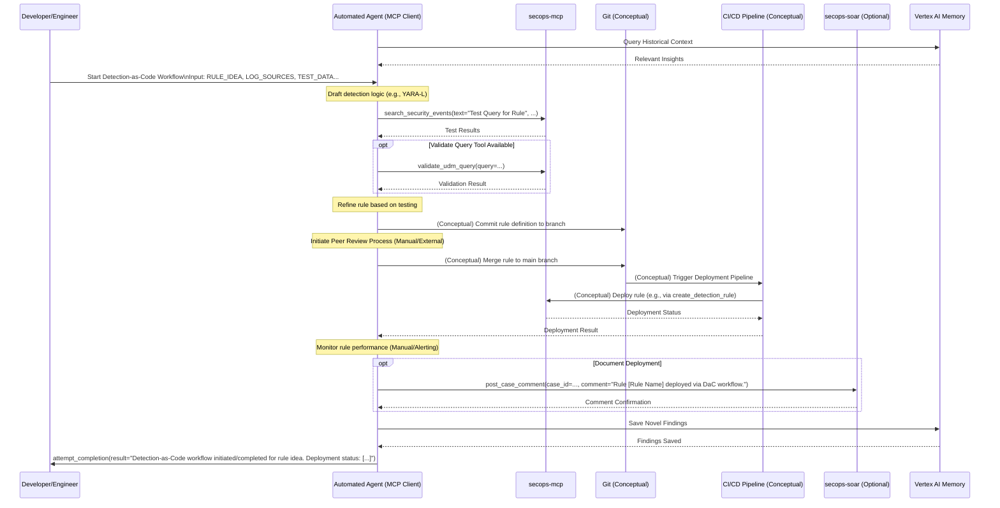

# Runbook: Detection-as-Code Workflow (Placeholder)

## Objective

*(Define the goal, e.g., To outline the process for developing, testing, reviewing, and deploying new detection rules using a Detection-as-Code methodology, potentially involving version control and CI/CD pipelines.)*

## Scope

*(Define what is included/excluded, e.g., Covers rule creation in a specific format (YARA-L, Sigma), testing procedures, peer review process, and deployment mechanism. Excludes infrastructure setup for the pipeline.)*

## Inputs

*   `${RULE_IDEA}`: Description of the threat or behavior the new rule should detect.
*   `${RELEVANT_LOG_SOURCES}`: Log sources needed for the detection.
*   `${TEST_DATA_LOCATION}`: Location of data suitable for testing the rule.
*   *(Optional) `${VERSION_CONTROL_BRANCH}`: Branch for developing the rule.*

## Tools

*   `secops-mcp`: `search_security_events` (for testing), `validate_udm_query` (if available), `list_security_rules` (to check existing rules)
*   *(Potentially Version Control tools like Git if integrated via MCP)*
*   *(Potentially CI/CD pipeline tools if integrated via MCP)*
*   *(Potentially rule deployment tools if available via MCP, e.g., `create_detection_rule`)*
*   `secops-soar`: `post_case_comment` (for tracking/review)

## Workflow Steps & Diagram
> **Query Memory Context:** Before deep analysis, use the `LoadMemoryTool` to retrieve historical context for the involved entities or alert types. Check appropriate topics such as `approved_exceptions`, `investigation_patterns`, or `asset_context` to avoid redundant effort and identify known benign behavior.

1.  **Rule Development:** Draft the detection logic based on `${RULE_IDEA}` and `${RELEVANT_LOG_SOURCES}`.
2.  **Testing:** Test the rule logic against `${TEST_DATA_LOCATION}` using `search_security_events` or other methods. Validate syntax (e.g., `validate_udm_query`).
3.  **Version Control:** Commit the rule definition to the appropriate `${VERSION_CONTROL_BRANCH}`.
4.  **Peer Review:** Initiate a code review process for the new rule.
5.  **Deployment:** Merge the rule to the main branch and trigger the deployment pipeline (or manually deploy using appropriate tools like `create_detection_rule`).
6.  **Monitoring:** Monitor the rule's performance post-deployment.

> **Save Findings to Memory:** If this workflow yielded novel insights (e.g., a new false positive rule, newly identified critical infrastructure, or a successful containment action), save these details to the memory bank under the appropriate topic (e.g., `analyst_notes`, `detection_rule_feedback`, or `containment_strategies`).

## Completion Criteria

*(Define how successful completion is determined, e.g., Rule successfully deployed to production environment, monitoring initiated.)*
