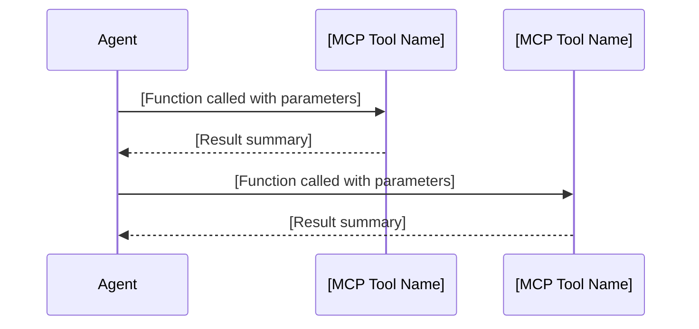
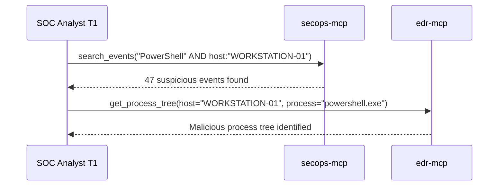

# Sub-Agent Response Format Guidelines

## Purpose
This document defines the standardized response format that all sub-agents MUST use when returning results to the SOC Manager during task delegation, especially during IRP execution. This ensures all findings are properly captured for final reporting.

## Required Response Structure

All sub-agent responses MUST follow this markdown format:

```markdown
## Task Summary
[Brief 1-2 sentence description of what was requested and what was completed]

## Findings
### Key Discoveries
- [Discovery 1]
- [Discovery 2]
- [Discovery 3]

### Technical Details
- **IOCs Identified:**
  - IP Addresses: [list]
  - Domains: [list]
  - File Hashes: [list]
  - File Paths: [list]
  - Registry Keys: [list]
  - User Accounts: [list]

- **Affected Systems:**
  - [System 1: details]
  - [System 2: details]

- **Timeline of Events:**
  - [Timestamp]: [Event]
  - [Timestamp]: [Event]

## Analysis & Assessment
### Risk Level
[Critical/High/Medium/Low] - [Justification]

### Impact Assessment
- **Business Impact:** [Description]
- **Technical Impact:** [Description]
- **Data Exposure:** [Yes/No - details if applicable]

### Threat Intelligence Context
[Any relevant threat actor information, TTPs, or campaign details]

## Actions Taken
### Immediate Actions
- [Action 1 with timestamp]
- [Action 2 with timestamp]

### Tool Usage


## Recommendations
### Immediate Actions Required
1. [Recommendation 1]
2. [Recommendation 2]

### Follow-up Actions
- [Action for next phase or agent]
- [Additional investigation needed]

## Metadata
- **Case ID:** [CASE_ID if applicable]
- **Timestamp:** [Response generation time]
- **Confidence Level:** [High/Medium/Low]
- **Data Sources Used:** [List of tools/sources]
```

## Usage Guidelines

1. **Completeness:** Include all sections even if some are marked as "N/A" or "None identified"

2. **Clarity:** Use clear, concise language suitable for both technical and management audiences

3. **Evidence-Based:** All findings must be supported by tool outputs or data sources

4. **IRP Context:** When working on IRP tasks, explicitly reference:
   - Which IRP phase this work relates to
   - Specific IRP step being executed
   - How findings relate to incident timeline

5. **Tool Documentation:** Always include the Mermaid diagram showing exact tool calls made

6. **Severity Indicators:** Use consistent severity/risk ratings:
   - Critical: Immediate action required, active compromise
   - High: Significant risk, prompt action needed
   - Medium: Notable risk, scheduled action appropriate
   - Low: Minor risk, informational

## Special Considerations for IRP Responses

During IRP execution, additionally include:

```markdown
## IRP Context
- **IRP Phase:** [Phase number and name]
- **Step Reference:** [Specific step from IRP]
- **Phase Objectives Met:** [Yes/Partial/No - explanation]
- **Dependencies for Next Phase:** [What the next agent/phase needs to know]
```

## Example Response

```markdown
## Task Summary
Investigated suspicious PowerShell activity on WORKSTATION-01 as part of Malware IRP Phase 2 (Identification).

## Findings
### Key Discoveries
- Confirmed malicious PowerShell script execution attempting to download secondary payload
- Process originated from compromised user account DOMAIN\jsmith
- Initial infection vector appears to be malicious email attachment

### Technical Details
- **IOCs Identified:**
  - IP Addresses: 192.168.50.101, 45.142.120.50
  - Domains: badactor.example.com
  - File Hashes: 5d41402abc4b2a76b9719d911017c592 (MD5)
  - File Paths: C:\Users\jsmith\AppData\Local\Temp\update.ps1

- **Affected Systems:**
  - WORKSTATION-01: User workstation, actively compromised
  - DC-01: Authentication attempts observed, no successful compromise

### Analysis & Assessment
#### Risk Level
High - Active malware presence with attempted lateral movement

### Tool Usage


## Recommendations
### Immediate Actions Required
1. Isolate WORKSTATION-01 immediately
2. Reset credentials for DOMAIN\jsmith
3. Block identified C2 IPs at perimeter

## IRP Context
- **IRP Phase:** Phase 2 - Identification
- **Step Reference:** Step 2.3 - Investigate affected endpoints
- **Phase Objectives Met:** Yes - Malware identified and scope determined
- **Dependencies for Next Phase:** Containment team needs isolation approval and credential reset list
```