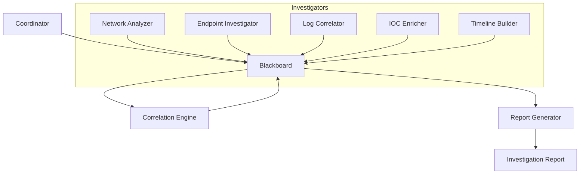

# SOC Blackboard Implementation Plan

## Overview

This document provides a comprehensive implementation plan for building a Security Operations Center (SOC) investigation system using Google's Agent Development Kit (ADK) and the Blackboard architectural pattern. The system enables multiple specialized security agents to collaborate on investigations by reading from and writing to a shared knowledge space.

## Architecture Overview

### The Blackboard Pattern

The Blackboard pattern is a behavioral design pattern where:
- Multiple specialized agents (knowledge sources) work independently
- All agents share a common data structure (the blackboard)
- No direct agent-to-agent communication is required
- Agents can read all areas but typically write to specific areas
- A coordinator manages the overall process

### Why Blackboard for SOC?

1. **Mimics Real SOC Operations**: Analysts share findings on a central platform
2. **Supports Parallel Investigation**: Multiple specialists can work simultaneously
3. **Enables Complex Correlations**: Patterns emerge from collective findings
4. **Maintains Audit Trail**: All findings are timestamped and preserved
5. **Flexible Scaling**: Easy to add new investigator types

## System Components

### 1. Blackboard Coordinator (`coordinator/`)

**Purpose**: Manages the investigation lifecycle and blackboard state

**Responsibilities**:
- Initialize the blackboard with an investigation context
- Orchestrate which investigators should be activated
- Monitor investigation progress
- Trigger synthesis agents when appropriate
- Manage investigation state (active, completed, archived)

**Implementation Details**:
```python
# coordinator/agent.py structure
- Uses DeferredInitializationAgent pattern for lazy loading
- Maintains references to all investigator and synthesizer agents
- Implements investigation workflow logic
- Provides tools for investigation management
```

### 2. Knowledge Store (`coordinator/blackboard/`)

**Purpose**: The shared knowledge space for all agents

**Knowledge Areas**:
```python
knowledge_areas = {
    "network_analysis": [],      # Network traffic findings
    "endpoint_behaviors": [],    # Host-based findings
    "log_correlations": [],      # Cross-system log patterns
    "ioc_enrichments": [],       # Threat intel enrichments
    "timeline_events": [],       # Temporal sequence of events
    "threat_intelligence": [],   # External threat data
    "risk_scores": {},          # Calculated risk metrics
    "investigation_metadata": {} # Case details, status, etc.
}
```

**Key Methods**:
- `write(area, finding, agent_name)`: Add finding with metadata
- `read(area=None)`: Read specific area or entire blackboard
- `query(filters)`: Advanced querying with filters
- `get_timeline()`: Get chronological view of all findings
- `export()`: Export investigation for reporting

### 3. Investigator Agents (`investigators/`)

#### 3.1 Network Analyzer
**Purpose**: Analyze network traffic for suspicious patterns

**Capabilities**:
- Detect unusual data transfers
- Identify suspicious connections
- Spot protocol anomalies
- Recognize C2 communication patterns

**Reads From**: All areas (for context)
**Writes To**: `network_analysis`

**Key Indicators to Detect**:
- Large data exfiltration
- Beaconing behavior
- Unusual ports/protocols
- Geographic anomalies

#### 3.2 Endpoint Investigator
**Purpose**: Investigate host-based activities

**Capabilities**:
- Analyze process behaviors
- Check file system changes
- Review registry modifications
- Examine running services

**Reads From**: `network_analysis`, `ioc_enrichments`
**Writes To**: `endpoint_behaviors`

**Key Indicators to Detect**:
- Suspicious process trees
- Persistence mechanisms
- Lateral movement artifacts
- Privilege escalation

#### 3.3 Log Correlator
**Purpose**: Find patterns across different log sources

**Capabilities**:
- Correlate authentication logs
- Match firewall and proxy logs
- Link application logs to system events
- Identify timing correlations

**Reads From**: All areas
**Writes To**: `log_correlations`

**Key Patterns to Find**:
- Failed login attempts followed by success
- Data access after hours
- Coordinated activities across systems
- Log gaps or tampering

#### 3.4 IOC Enricher
**Purpose**: Enrich indicators with threat intelligence

**Capabilities**:
- Query threat intel platforms
- Check reputation services
- Find related campaigns
- Identify threat actor TTPs

**Reads From**: `network_analysis`, `endpoint_behaviors`
**Writes To**: `ioc_enrichments`, `threat_intelligence`

**Enrichment Sources**:
- VirusTotal API
- Chronicle threat intel
- MITRE ATT&CK mapping
- Known threat actor databases

#### 3.5 Timeline Builder
**Purpose**: Construct chronological event sequence

**Capabilities**:
- Order events by timestamp
- Identify event clusters
- Find temporal gaps
- Highlight critical moments

**Reads From**: All areas
**Writes To**: `timeline_events`

**Timeline Elements**:
- Initial compromise indicators
- Lateral movement timeline
- Data staging/exfiltration times
- Cleanup/anti-forensics activities

### 4. Synthesizer Agents (`synthesizers/`)

#### 4.1 Correlation Engine
**Purpose**: Find patterns and connections across all findings

**Capabilities**:
- Identify attack chains
- Spot coordinated activities
- Calculate aggregate risk scores
- Detect hidden relationships

**Reads From**: All areas
**Writes To**: `risk_scores`, new correlation findings

**Correlation Types**:
- Temporal correlations
- Entity relationships
- Behavioral patterns
- Statistical anomalies

#### 4.2 Report Generator
**Purpose**: Create comprehensive investigation reports

**Capabilities**:
- Generate executive summaries
- Create detailed technical reports
- Produce indicator lists
- Generate remediation recommendations

**Report Sections**:
- Investigation Summary
- Timeline of Events
- Technical Findings
- Risk Assessment
- Recommendations
- Indicators of Compromise

## Implementation Steps

### Phase 1: Core Infrastructure (Week 1)

1. **Implement Knowledge Store**
   ```python
   # coordinator/blackboard/knowledge_store.py
   class InvestigationBlackboard:
       def __init__(self, investigation_id: str):
           self.investigation_id = investigation_id
           self.created_at = datetime.now()
           self.knowledge_areas = {...}
           self.lock = asyncio.Lock()  # For thread safety
   ```

2. **Create Coordinator Agent**
   - Implement DeferredInitializationAgent pattern
   - Add investigation management methods
   - Create orchestration logic

3. **Set Up Base Agent Pattern**
   ```python
   # Common pattern for all investigator agents
   def get_agent(tools, blackboard, exit_stack):
       persona, runbooks = load_persona_and_runbooks(
           'network_analyzer',
           ['network_investigation', 'traffic_analysis']
       )
       
       return Agent(
           name="network_analyzer",
           model="gemini-2.5-pro-preview-05-06",
           description=persona,
           instruction=persona + runbooks,
           tools=tools,
           # Custom context includes blackboard reference
           context={"blackboard": blackboard}
       )
   ```

### Phase 2: Investigator Agents (Week 2)

1. **Implement Each Investigator**
   - Network Analyzer: Focus on Chronicle SIEM queries
   - Endpoint Investigator: Use EDR data analysis
   - Log Correlator: Multi-source correlation logic
   - IOC Enricher: Integrate VirusTotal and threat intel
   - Timeline Builder: Temporal analysis algorithms

2. **Add Specialized Tools**
   - Each investigator needs access to specific MCP tools
   - Share common tools through coordinator
   - Add blackboard read/write tools

### Phase 3: Synthesizer Agents (Week 3)

1. **Correlation Engine**
   - Implement pattern matching algorithms
   - Add risk scoring logic
   - Create relationship mapping

2. **Report Generator**
   - Design report templates
   - Implement markdown/PDF generation
   - Add visualization capabilities

### Phase 4: Integration & Testing (Week 4)

1. **Integration Testing**
   - Test agent interactions
   - Verify blackboard consistency
   - Check investigation workflows

2. **Performance Optimization**
   - Implement caching for expensive operations
   - Add parallel processing where appropriate
   - Optimize blackboard queries

## Technical Implementation Details

### Agent Communication Flow



### Blackboard Write Operation

```python
async def write_finding(self, area: str, finding: dict, agent_name: str):
    """Write a finding to the blackboard with full context"""
    async with self.lock:
        entry = {
            "id": str(uuid.uuid4()),
            "timestamp": datetime.now().isoformat(),
            "agent": agent_name,
            "area": area,
            "finding": finding,
            "confidence": finding.get("confidence", "medium"),
            "tags": finding.get("tags", [])
        }
        
        self.knowledge_areas[area].append(entry)
        
        # Trigger any subscribers
        await self.notify_subscribers(area, entry)
```

### Investigation Workflow

```python
class InvestigationWorkflow:
    """Manages the investigation lifecycle"""
    
    async def start_investigation(self, initial_context: dict):
        # 1. Initialize blackboard with context
        blackboard = InvestigationBlackboard(
            investigation_id=initial_context["case_id"]
        )
        
        # 2. Activate relevant investigators based on context
        investigators = self.select_investigators(initial_context)
        
        # 3. Run investigators in parallel
        await asyncio.gather(*[
            inv.investigate(blackboard, initial_context) 
            for inv in investigators
        ])
        
        # 4. Run correlation engine
        await self.correlation_engine.analyze(blackboard)
        
        # 5. Generate report
        report = await self.report_generator.create_report(blackboard)
        
        return report
```

### MCP Tool Integration

```python
# Each agent gets access to shared MCP tools
shared_tools = [
    chronicle_search_tool,
    soar_case_tool,
    virustotal_tool,
    # Blackboard-specific tools
    BlackboardReadTool(blackboard),
    BlackboardWriteTool(blackboard),
    BlackboardQueryTool(blackboard)
]
```

## Configuration

### Environment Variables (.env.example)

```bash
# Google AI
GOOGLE_API_KEY=your_api_key_here

# MCP Security Tools
CHRONICLE_PROJECT_ID=your_gcp_project_id
CHRONICLE_CUSTOMER_ID=your_chronicle_customer_id
CHRONICLE_REGION=us
SOAR_URL=https://your-soar-instance.example.com
SOAR_APP_KEY=your_soar_app_key
VT_APIKEY=your_virustotal_api_key

# Investigation Settings
MAX_INVESTIGATION_DURATION=3600  # seconds
DEFAULT_CONFIDENCE_THRESHOLD=0.7
ENABLE_AUTO_CORRELATION=true
REPORT_FORMAT=markdown  # or pdf
```

### Investigation Context Schema

```python
investigation_context = {
    "case_id": "INC-2024-001",
    "title": "Suspected Data Exfiltration",
    "priority": "high",
    "initial_indicators": [
        {"type": "ip", "value": "10.0.0.100"},
        {"type": "username", "value": "compromised_user"},
        {"type": "timerange", "start": "2024-01-01T00:00:00Z", "end": "2024-01-02T00:00:00Z"}
    ],
    "data_sources": ["chronicle", "edr", "firewall_logs"],
    "investigation_type": "data_theft"
}
```

## Testing Strategy

### Unit Tests

1. **Blackboard Operations**
   - Test concurrent read/write operations
   - Verify data consistency
   - Test query functionality

2. **Individual Agents**
   - Mock blackboard interactions
   - Test finding generation
   - Verify tool usage

### Integration Tests

1. **End-to-End Investigation**
   - Provide sample security event
   - Verify all agents contribute
   - Check final report generation

2. **Performance Tests**
   - Measure investigation completion time
   - Test with large datasets
   - Verify parallel processing

### Test Scenarios

1. **Ransomware Investigation**
   - Initial encryption behavior
   - Lateral movement detection
   - C2 communication identification

2. **Data Exfiltration**
   - Large data transfers
   - Unusual access patterns
   - External communication

3. **Insider Threat**
   - Privilege escalation
   - Data access anomalies
   - Behavioral changes

## Usage Examples

### Starting an Investigation

```python
# Initialize the coordinator
coordinator = BlackboardCoordinator()

# Define investigation context
context = {
    "case_id": "INC-2024-001",
    "title": "Suspicious Network Activity",
    "initial_indicators": [
        {"type": "ip", "value": "192.168.1.100"},
        {"type": "timerange", "start": "2024-01-01T00:00:00Z", "end": "2024-01-01T12:00:00Z"}
    ]
}

# Start investigation
report = await coordinator.investigate(context)
print(report)
```

### Querying the Blackboard

```python
# Find all high-confidence network findings
network_findings = await blackboard.query({
    "area": "network_analysis",
    "confidence": "high",
    "timerange": {"last": "1h"}
})

# Get complete timeline
timeline = await blackboard.get_timeline()

# Export investigation
export_data = await blackboard.export(format="json")
```

## Success Criteria

1. **Functional Requirements**
   - All investigators can read/write to blackboard
   - Correlation engine identifies multi-source patterns
   - Reports contain actionable findings

2. **Performance Requirements**
   - Investigation completes within 5 minutes
   - Supports concurrent investigations
   - Handles 10,000+ findings per investigation

3. **Quality Requirements**
   - 90%+ finding accuracy
   - No false correlation patterns
   - Clear, actionable reports

## Future Enhancements

1. **Machine Learning Integration**
   - Anomaly detection models
   - Pattern learning from past investigations
   - Automated threat classification

2. **Real-time Streaming**
   - WebSocket support for live updates
   - Streaming findings as they're discovered
   - Real-time collaboration features

3. **Investigation Playbooks**
   - Predefined investigation workflows
   - Automated response actions
   - Compliance reporting templates

## Notes for Implementation Team

1. **Start Simple**: Begin with basic blackboard operations and one investigator
2. **Use Existing Patterns**: Follow the multi-agent patterns from the main project
3. **Leverage MCP Tools**: Don't reinvent security tool integrations
4. **Focus on SOC Value**: Ensure each agent provides real investigative value
5. **Document Findings**: Use clear, consistent finding formats

This implementation plan provides a comprehensive guide for building the SOC Blackboard system. The modular design allows for incremental development while maintaining a clear vision of the complete system.