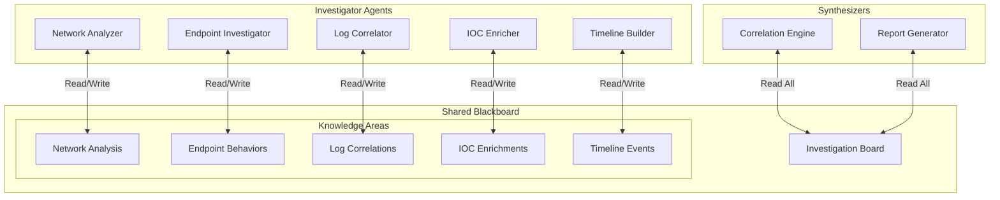
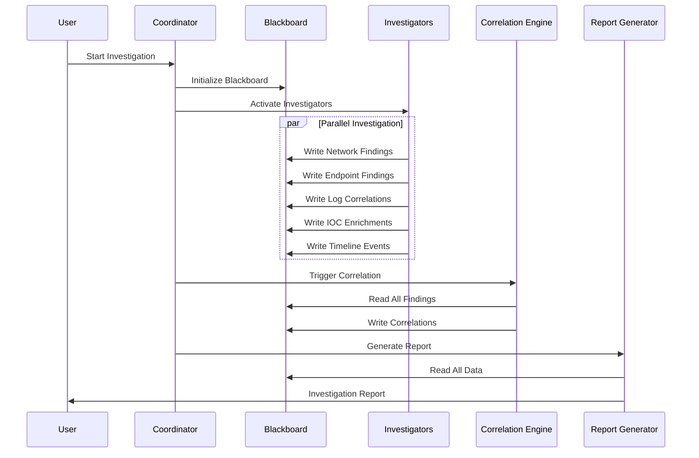

# SOC Blackboard System

A multi-agent Security Operations Center (SOC) investigation system built on Google's Agent Development Kit (ADK) using the Blackboard architectural pattern. This system enables multiple specialized security agents to collaborate on investigations by sharing findings through a centralized knowledge store.

## Overview

The SOC Blackboard system implements a collaborative investigation platform where:
- Multiple specialized security agents work independently
- All findings are shared through a central "blackboard" knowledge store
- No direct agent-to-agent communication is required
- A correlation engine identifies patterns across all findings
- Comprehensive reports are automatically generated

## Architecture

### The Blackboard Pattern



## Components

### Coordinator
- **Purpose**: Manages the investigation lifecycle
- **Location**: `coordinator/`
- **Responsibilities**: Initialize investigations, orchestrate agents, monitor progress

### Knowledge Store (Blackboard)
- **Purpose**: Shared knowledge space for all agents
- **Location**: `coordinator/blackboard/`
- **Knowledge Areas**:
  - Network Analysis
  - Endpoint Behaviors
  - Log Correlations
  - IOC Enrichments
  - Timeline Events
  - Threat Intelligence
  - Risk Scores

### Investigator Agents
Located in `investigators/`:

1. **Network Analyzer**: Analyzes network traffic patterns
2. **Endpoint Investigator**: Investigates host-based activities
3. **Log Correlator**: Finds patterns across log sources
4. **IOC Enricher**: Enriches indicators with threat intelligence
5. **Timeline Builder**: Constructs chronological event sequences

### Synthesizer Agents
Located in `synthesizers/`:

1. **Correlation Engine**: Identifies patterns across all findings
2. **Report Generator**: Creates comprehensive investigation reports

## Quick Start

### Prerequisites

- Python 3.8+
- Google API key (for Gemini models)
- MCP Security tool credentials (Chronicle, SOAR, VirusTotal)

### Installation

1. **Clone the repository**:
   ```bash
   git clone --recurse-submodules https://github.com/dandye/adk_runbooks.git
   cd adk_runbooks/soc-blackboard
   ```

2. **Set up virtual environment**:
   ```bash
   python -m venv venv
   source venv/bin/activate  # On Windows: venv\Scripts\activate
   ```

3. **Install dependencies and MCP security tools**:
   ```bash
   ./setup_mcp_tools.sh
   ```
   
   Or manually:
   ```bash
   pip install -r requirements.txt
   pip install -e ../external/mcp-security/server/secops
   pip install -e ../external/mcp-security/server/gti
   pip install -e ../external/mcp-security/server/secops-soar
   pip install -e ../external/mcp-security/server/scc
   ```

4. **Configure environment**:
   ```bash
   cp .env.example .env
   # Edit .env with your Google Cloud project and API keys
   ```

5. **Set up Google Cloud authentication**:
   ```bash
   gcloud auth application-default login
   ```

### Configuration

Edit `.env` with your credentials:

```bash
# Google AI
GOOGLE_API_KEY=your_api_key_here

# Google Security Operations (Chronicle SIEM)
CHRONICLE_PROJECT_ID=your_gcp_project_id
CHRONICLE_CUSTOMER_ID=your_chronicle_customer_id
CHRONICLE_REGION=us

# Google Security Operations SOAR
SOAR_URL=https://your-soar-instance.example.com
SOAR_APP_KEY=your_soar_app_key

# Google Threat Intelligence & Security Command Center
# (Use same GCP project authentication as Chronicle)

# Investigation Settings
MAX_INVESTIGATION_DURATION=3600
DEFAULT_CONFIDENCE_THRESHOLD=0.7
ENABLE_AUTO_CORRELATION=true
```

**Available MCP Security Tools:**
- **Chronicle (SecOps)**: `search_security_events`, `search_security_alerts`, `entity_lookup`, `search_security_rules`, `search_ioc_matches`, `search_threat_intel`
- **Google Threat Intelligence**: `search_collections`, `search_files`, `search_intelligence`, `search_netloc`, `search_threat_profiles`, `search_urls`
- **SOAR**: `create_case`, `get_case`, `update_case`, `list_cases`
- **Security Command Center**: Cloud security and risk management tools

### Running an Investigation

```bash
# Run the coordinator agent
adk run coordinator

# Or use the web interface
adk web
```

## Usage Examples

### Starting an Investigation

```python
from coordinator.agent import BlackboardCoordinator

# Initialize coordinator
coordinator = BlackboardCoordinator()

# Define investigation context
context = {
    "case_id": "INC-2024-001",
    "title": "Suspicious Network Activity",
    "priority": "high",
    "initial_indicators": [
        {"type": "ip", "value": "192.168.1.100"},
        {"type": "username", "value": "suspected_user"},
        {"type": "timerange", "start": "2024-01-01T00:00:00Z", "end": "2024-01-01T12:00:00Z"}
    ],
    "data_sources": ["chronicle", "edr", "firewall_logs"]
}

# Start investigation
report = await coordinator.investigate(context)
```

### Example Prompts

- "Investigate suspicious data exfiltration from IP 10.0.0.100 in the last 24 hours"
- "Analyze potential ransomware activity on endpoint DESKTOP-ABC123"
- "Correlate authentication failures across all systems for user john.doe"
- "Build timeline for security incident INC-2024-001"

## How It Works

1. **Investigation Initiation**: Coordinator receives investigation context
2. **Agent Activation**: Relevant investigator agents are activated based on context
3. **Parallel Investigation**: Agents work simultaneously, writing findings to blackboard
4. **Knowledge Sharing**: Each agent can read all blackboard areas for context
5. **Pattern Recognition**: Correlation engine analyzes collective findings
6. **Report Generation**: Final report synthesizes all discoveries

## Investigation Flow



## Key Features

### For SOC Analysts
- **Parallel Investigation**: Multiple aspects investigated simultaneously
- **Automatic Correlation**: Hidden patterns automatically discovered
- **Comprehensive Timeline**: Events ordered chronologically
- **Threat Intelligence**: Automatic IOC enrichment via Google GTI
- **Detailed Reports**: Ready-to-share investigation summaries
- **Real Security Tools**: Direct integration with Chronicle, SOAR, and GTI

### For Security Engineers
- **Modular Design**: Easy to add new investigator types
- **MCP Tool Integration**: Uses real Google security tools (Chronicle, GTI, SOAR, SCC)
- **Scalable Architecture**: Handles complex investigations
- **Audit Trail**: All findings timestamped and preserved
- **Extensible Platform**: Add new MCP tools easily

## Development

### Adding a New Investigator

1. Create directory under `investigators/`:
   ```bash
   mkdir investigators/new_investigator
   touch investigators/new_investigator/{__init__.py,agent.py}
   ```

2. Implement the agent pattern:
   ```python
   def get_agent(tools, blackboard, exit_stack):
       return Agent(
           name="new_investigator",
           model="gemini-2.5-pro-preview-05-06",
           description="Investigates specific security aspect",
           instruction="Your investigation instructions...",
           tools=tools,
           context={"blackboard": blackboard}
       )
   ```

3. Register with coordinator

### Testing

```bash
# Run tests
python -m pytest tests/

# Run specific test
python -m pytest tests/test_blackboard.py
```

## Performance Considerations

- Investigations typically complete in 2-5 minutes
- Supports concurrent investigations
- Handles 10,000+ findings per investigation
- Automatic cleanup of completed investigations

## MCP Security Tools Integration

The SOC Blackboard system integrates with the real MCP security tools from `external/mcp-security`:

### Available Tool Categories

1. **Google Security Operations (Chronicle)**
   - `search_security_events`: Deep UDM event searches
   - `search_security_alerts`: Alert investigation
   - `entity_lookup`: IOC and entity enrichment
   - `search_security_rules`: Rule analysis
   - `search_ioc_matches`: Indicator matching
   - `search_threat_intel`: Threat intelligence lookups

2. **Google Threat Intelligence (GTI)**
   - `search_collections`: Threat collection analysis
   - `search_files`: File intelligence
   - `search_intelligence`: General threat intel
   - `search_netloc`: Network location analysis
   - `search_threat_profiles`: Actor and campaign data
   - `search_urls`: URL reputation and analysis

3. **Security Operations SOAR**
   - `create_case`: Case management
   - `get_case`: Case retrieval
   - `update_case`: Case updates
   - `list_cases`: Case listing

4. **Security Command Center (SCC)**
   - Cloud security and risk management tools

### Testing Integration

Test your MCP tools setup:
```bash
python test_mcp_integration.py
```

## Troubleshooting

### Common Issues

1. **MCP tools not loading**:
   - Run `./setup_mcp_tools.sh` to install dependencies
   - Verify Google Cloud authentication: `gcloud auth application-default login`
   - Check .env configuration matches your GCP project

2. **Agent not contributing findings**:
   - Check agent has blackboard write permissions
   - Verify MCP tool credentials
   - Review agent logs in `adk_logs/`

3. **Correlation not finding patterns**:
   - Ensure sufficient findings in blackboard
   - Check correlation thresholds in config
   - Verify all investigators completed

4. **Report generation fails**:
   - Check blackboard has data
   - Verify report template exists
   - Review report generator logs

## Security Considerations

- API keys stored in environment variables
- Blackboard data can be encrypted at rest
- Investigation data retained per compliance requirements
- Access control can be implemented per agent

## Future Enhancements

- Real-time investigation updates via WebSocket
- Machine learning for pattern recognition
- Automated response capabilities
- Integration with ticketing systems
- Custom investigation playbooks

## Contributing

See the main project's contributing guidelines. When adding features:
1. Follow the existing agent patterns
2. Update the implementation plan
3. Add appropriate tests
4. Document new capabilities

## License

This project is licensed under the MIT License - see the main project's LICENSE file for details.

## Acknowledgments

- Built on [Google's Agent Development Kit (ADK)](https://github.com/google/adk)
- Uses the Blackboard architectural pattern
- Integrates with MCP Security tools